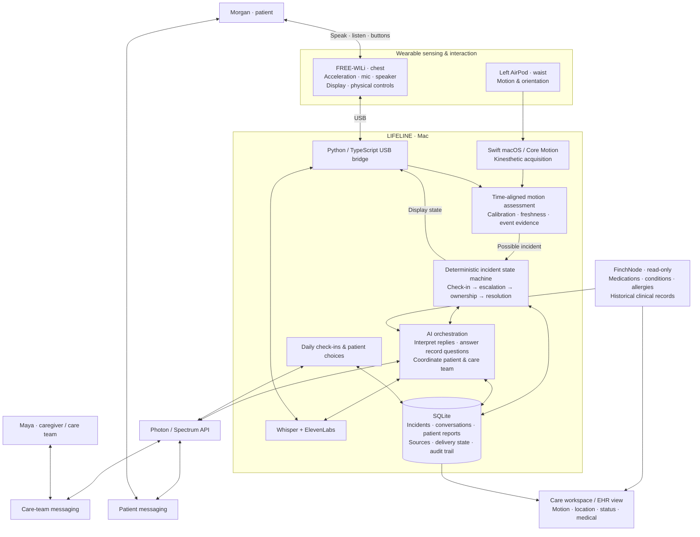

# LIFELINE

MHacks 2026 — Actually Intelligent (AI). LIFELINE combines read-only patient records, conversational coordination, and an incident loop followed through responder acceptance, progress, and a recorded outcome. Falls are the first intended physical trigger. The iPhone is the Photon/iMessage communication channel. The [product requirements](docs/PRD.md) define the demo scope, policy, and acceptance gates.

**Current implementation:** structured Finch synthetic records, record questions, immutable incident context, threaded Photon replies, wearer updates, and source-separated care-brief export are implemented. The iPhone app is communication only. The connected original FREE-WILi uses its official stock SDK for acceleration, display, help/okay buttons and board audio. A provisional WILi + waist-AirPod detector and bounded local microphone transcription are implemented; physical sensing accuracy and end-to-end messaging still require rehearsal. See the [migration plan](docs/device-and-record-migration.md). Camera work is out of scope.

## Tech stack

| Layer | Technology and role |
| --- | --- |
| Backend | Node.js 24 + TypeScript; HTTP and WebSocket services |
| Persistence | SQLite; incident state, deadlines, action outbox, conversations and audit history |
| Frontend | HTML, CSS and JavaScript; Three.js for the interactive apartment location view |
| Primary wearable | FREE-WILi stock SDK; chest acceleration, microphone, speaker, buttons and display |
| WILi bridge | Python + TypeScript over USB |
| Secondary sensing | Left AirPod at the waist; native Swift macOS app using Core Motion, incorporating Kinesthetic acquisition code |
| Phone | Native Swift/SwiftUI iOS communication companion and the patient's existing messaging interface |
| Messaging | Photon / Spectrum API; patient and care-team conversations |
| Voice | Local Whisper transcription; ElevenLabs speech generation |
| Clinical context | FinchNode read-only synthetic records; source-validated answers and saved clinical snapshots |
| AI and policy | Configurable LLM for conversational interpretation and record answers; deterministic incident state machine for escalation, ownership and resolution |

The Mac acquires AirPod motion directly. The iPhone is the communication surface, not the chest sensor or camera.

## Architecture



One LIFELINE agent coordinates multiple human interfaces against one incident state. Sending an alert is not responder acceptance. Patient-reported observations remain separate from hospital records, and missing measurements remain unknown. The apartment view is a configured location visualization, not measured indoor positioning.

## Start

Requires Node 24+ and npm. Native builds require Xcode on macOS.

```sh
npm ci
npm run setup:local
npm start
```

`setup:local` creates a private `.env` for phone access on the development network, pairs the Mac app without printing its token, and builds/installs it in `~/Applications`. Existing environment settings are preserved. Connect the AirPods and start motion in the installed app.

Open **http://127.0.0.1:8877** for the story, or **http://127.0.0.1:8877/dashboard** for the incident workspace. Overview shows the current wearer report, care context, responder ownership and next step. Conversation, Motion, Care context, Audit trail and Connections have separate views. Turn on **Developer tools** to access simulation, reset, recording and rehearsal controls; those controls do not appear during ordinary care. Saved resets remain in the audit history while Overview returns to a calm idle state. WILi keeps its last measured acceleration on screen between sparse reports, with numeric zero only as the labelled initial display. Quiet readings show Idle; original freshness and acquisition diagnostics remain under Sensor details. The display cache does not feed detection or calibration.

**Demo controls:** open **http://127.0.0.1:8877/dashboard#dev**, or press **Cmd/Ctrl+Shift+D**. **Reset to start** ends the current rehearsal, clears detector history and preserves a current session's calibration. **Start demo check-in** works without sensors or calibration and labels its generated trigger. Reset keeps the prior run in the audit trail. WILi defaults to **5/10** speaker volume, verifies the board setting before enabling playback, and restores a closed incident's screen silently on reconnect. Set `LIFELINE_WILI_MUTED=1` for a silent bridge.

For the accelerated silence demo, use `npm run start:demo`. New check-ins use five seconds and display the acceleration from the normal configurable policy. Existing persisted deadlines stay intact. Positive or ambiguous wearer messages preserve the existing deadline; only the explicit current-check-in control cancels before escalation.

The default backend is Node + SQLite, with persisted deadlines and an action outbox. Data, recordings, tokens, and native build products are ignored by Git. No keys or approved phones are configured by default. Unconfigured providers do not claim delivery. FinchNode uses its public synthetic demo.

## Patient workspace

Open `/ehr` for the protected read-only patient workspace: allergies, conditions, medication status and history, dated vital charts, original source records and questions grounded in the selected clinical revision. Choose the current Finch read or a saved incident snapshot; refreshing the current record cannot rewrite earlier incident evidence.

Care context groups active prescriptions separately from historical regimens, administrations and dispenses. Source IDs, codes, synchronization metadata and complete answers are available in disclosures; historical measurement dates remain visible.

The Care log shows the wearer's daily conversation, attributed reports, responder ownership and recorded outcomes separately from hospital records. Captured WILi/AirPod evidence retains its original measurements and timing method. Manual requests have no invented motion values. Export care brief downloads a JSON packet containing these separate sources and the clinical snapshots behind saved answers. Finch's fictional subject is explicitly unlinked from the actual wearer; this workspace does not write to a hospital EHR or send messages.

## Native sensors

```sh
npm run build:airpods
npm run build:ios
```

The Mac app directly incorporates Kinesthetic's acquisition and audio route keeper. `KeepAlive.swift` is unchanged; the bridge adds acceleration/gravity, LIFELINE packets, clock synchronization, and source/session validation. See [native provenance](native/PROVENANCE.md).

For the actual phone, open `native/ios/LifelinePhone.xcodeproj` in Xcode, select your signing team and connected iPhone, then build/run. The automated build checks the simulator target without launching it; it does not establish hardware sensing.

The installer can build/sign/install once the phone is connected and your Xcode account is available:

```sh
npm run install:ios -- TEAM_ID DEVICE_UDID
```

`npm run build:ios:device` checks the physical target without signing; it cannot install on a real iPhone.

For phone-to-Mac access, run with `LIFELINE_HOST=0.0.0.0 npm start` on a trusted development network. Visit the dashboard from this Mac to obtain the pairing token and LAN address, then enter them in the native apps. The server's default binding is local-only. Test venue connectivity before relying on it. Keep the phone app foregrounded. The reporting AirPod is mounted at the waist. FREE-WILi is the primary body sensor; the original v54 board is connected through the [stock SDK bridge](native/freewili/README.md). Start with chest placement for access to its buttons and speaker. The phone supplies no motion or audio. Standing tilt calibration is optional for the AirPod; the provisional detector uses acceleration and rotation without requiring that baseline.

Open **Calibration guide** on the dashboard: stand upright and still for three seconds, then walk a few steps for three seconds. The guide verifies the saved waist baseline before advancing and checks actual motion during the walking step. Technical readings are under **Details**. The request is bound to the reporting AirPod session and side; closing cancels the countdown, and a reconnect requires starting again. WILi supplies acceleration rather than an orientation baseline. Keep its USB connection to the Mac in place for this implementation.

See [native setup](docs/native-setup.md) for off-ear acquisition, reporting-bud checks, audio routing, and device installation. Native apps never substitute simulated sensor input.

For the wired demo with the paired Debug app installed, keep the iPhone unlocked
and connected by USB, then run `npm run device:usb -- DEVICE_UDID` alongside the
backend. This starts a foreground relay on the connected device's developer
tunnel and launches the communication companion without changing saved Wi-Fi pairing. Keep the
cable and helper connected for status access.

## Providers

Copy `.env.example` to `.env` and configure only the integrations being used. Photon uses its cloud provider; responders must have approved phone numbers in `LIFELINE_RESPONDERS_JSON`. Approved phone identity, the persisted native chat/line and the alert's provider message ID determine who can accept. Exact incident-coded text commands are `ON IT`, `DEPART`, `ARRIVED`, `DECLINE`, or `RESOLVED`, followed by the full incident ID; resolution also requires an outcome. Removed reactions do not release ownership.

**Autonomous demo dispatch:** run `npm run start:dispatch` or set `LIFELINE_DISPATCH_MODE=simulated`. After the wearer requests help or the normal check-in expires, a simulated human Maya receives the local alert, accepts, departs, arrives and records a simulated outcome. No second phone or dashboard progress clicks are required. Maya's replies use the existing ElevenLabs/WILi speech pipeline. The dashboard, wearable, wearer iMessages and saved care brief label the simulated dispatch; real sensing, wearer speech, Finch retrieval and wearer Photon receipts retain their actual sources. The approved live responder list stays saved for `LIFELINE_DISPATCH_MODE=live`. Finish an active incident before switching modes. Optional `LIFELINE_SIMULATED_STEP_MS=1000` shortens dispatch rehearsal pacing without changing the wearer check-in deadline. The demo creates no responder GPS or real iMessage delivery evidence.

Set `LIFELINE_WEARER_PHONE` to the approved wearer's E.164 number to send a companion Photon iMessage: “I detected a possible fall. Are you okay?” It shares the incident deadline. Audible interaction belongs to the WILi audio path; the phone does not speak or listen. Ordinary wearer text in the accepted current conversation needs no copied code. “I need help” escalates during check-in; positive or ambiguous prose preserves the check-in and directs the wearer to WILi's green button. After help is requested, new wearer texts are quoted to the responder and refresh the handoff while preserving ownership and deadlines. Wearer and responder numbers must differ. The dashboard tracks wearer messaging configuration and the actual send outcome.

Set `LIFELINE_WEARER_NAME` for spoken-report attribution. A statement such as “I fell pretty hard. My ankle hurts and I can't stand up” requests help and forwards the exact transcript as a separate attributed message to approved responders. Their ordinary reply in the established incident conversation is recorded and spoken on WILi using live ElevenLabs synthesis. The conversation card shows the actual wearable queue/playback status; spoken reports remain separate from read-only hospital records and are included in the care brief. A conversational reply does not itself assign ownership or resolve the incident.

LIFELINE also checks in socially every day, defaulting to **2 p.m. in the wearer's local timezone**. Set `LIFELINE_WELLBEING_HOUR` and `LIFELINE_WELLBEING_TIMEZONE` to change the schedule, or `LIFELINE_WELLBEING_ENABLED=0` to disable it. The backend must be running. Each local date has one persisted prompt; scheduled prompts expire after six hours rather than appearing late at night. The wearer replies in the same private Photon conversation, or **holds WILi's blue button, speaks, then releases to send**. Local Whisper transcribes up to fifteen seconds of voice. LIFELINE responds with a short conversational follow-up through the configured model, with an explicit fallback when inference is unavailable. The Daily wellbeing card shows exact words, their text/voice source, and actual submission state. These are local conversations, separate from hospital EHR facts. A missed reply or a statement of loneliness does not trigger an incident; explicit help requests still use the incident policy. Incident response takes priority over the daily conversation. **Send today's check-in** is an authenticated rehearsal control; the daily schedule runs automatically and deduplicates across restarts.

The same conversation also accepts **“What allergies are recorded?”** and **“What medications are recorded?”** outside an incident. Clinical questions use the grounded Finch record engine; social conversation uses the companion model. Every clinical reply identifies the fictional Finch subject and says the record is not the wearer's personal record. Saved source IDs, revision, retrieval time and AI/template/refusal status appear beneath the answer, separately from delivery. **Download care journal** exports the most recent 40 attributed messages and each answer's original synthetic snapshot, protected by the operator token. Refreshing Finch does not replace those saved sources. Neither the journal nor wearer reports write to a hospital EHR.

Run `npm run smoke:care` for an isolated rehearsal using the real synthetic Finch endpoint and configured local model. It checks social replies, cited allergy/medication answers, unknown current vitals, treatment refusal, incident preemption and saved snapshots. Inputs are generated text; no microphone acquisition or external message delivery is asserted. Evidence is saved to `output/verification/care-flow-current.json`.

**Shared location** uses Photon's native Find My flow, adapted from Nook. LIFELINE sends one sharing request into the wearer's existing accepted iMessage conversation; the wearer grants access in Messages. It then watches that approved person's shared location. An accepted responder receives a separate incident-bound sharing request in their own conversation. The dashboard shows the measured position, capture age, known or unknown accuracy, Photon Find My source and Apple Maps link. Recent, accurate wearer and owner positions feed an Apple Maps walking ETA; routing failure uses a labelled straight-line approximation. Once the responder explicitly confirms departure, at most one ETA update per minute is queued to the wearer's iMessage. A request receipt does not grant location access. Coordinates never accept responsibility, confirm arrival, resolve an incident, or become hospital records. Stop native sharing in Messages.

Build the Mac routing helper with `npm run build:eta`. Native Find My requires the existing Photon credentials and approved phone configuration, with `LIFELINE_FIND_MY_ENABLED=1` (the default); no public URL or tunnel is needed. The authenticated dashboard button requests location in iMessage, and onboarding also runs automatically after an accepted wearer conversation exists. Requests persist across restarts, including uncertain results, without repeated cards. The watch reconnects and refreshes line credentials. Freshness uses the provider's capture timestamp, never the time an old snapshot was received.

Optional browser sharing remains available by setting `LIFELINE_LOCATION_PUBLIC_URL` to an HTTPS origin targeting **127.0.0.1:8879**, the separate location gateway. It exposes only mobile sharing assets and bearer-scoped location endpoints. Browser sharing is foreground-only, pauses when the page is hidden, resumes on a tap, and expires after two hours. Its Stop control revokes browser consent only; native Find My sharing is managed in Messages. Leave the public URL empty for the native demo.

**Start demo check-in** opens the voice check-in; the red/help button requests help immediately. The console shows actual microphone stages: speaking, listening, transcribing, and transcript received. Photon submissions are serialized with `LIFELINE_MESSAGE_GAP_MS` (default 5000 ms), with alerts and conversation ahead of routine updates. This local pacing does not establish Photon's quota or delivery. Uncertain submissions remain unknown and are never retried automatically.

Run the physical voice smoke test with the normal 20-second deadline:

```sh
# Stop the foreground WILi bridge so this test can own its DISPLAY port.
npm run smoke:voice -- --port /dev/cu.usbmodem1201 --audio-device "MacBook Pro Speakers"
```

The test plays a generated wearer statement through the selected Mac speakers into WILi's real microphone, uses actual local Whisper, checks the exact recorded outbound quote, and plays a clearly labelled synthetic responder reply through ElevenLabs and WILi. Its private temporary backend uses a recording transport and sends no cloud messages. It checks fresh acceleration after playback and reports whether transcription reached policy within 20 seconds. Keep the device close enough to hear the Mac speakers; restart its normal foreground bridge after testing. This verifies the audio and policy loop; a live Photon exchange and physical fall detection are separate checks.

On Photon's shared plan, each approved person should initiate a conversation with their assigned project number before rehearsal. The observed upstream new-contact rule caps replies at ten while fewer than three inbound messages have arrived; if that limit appears, have the person send a new text in the assigned conversation, then verify a fresh reply. Registration and a text to Photon's separate debug bot do not satisfy this project conversation. Previous uncertain sends remain unknown and are not replayed automatically.

Run `npm run check:photon` to inspect approved conversations, assigned-line identity and native delivery evidence without sending messages or changing the outbox. Add `-- --output output/photon-readiness.json` for a private report. Incoming-message counts describe observed history; they do not expose the provider's quota. A text/time match remains a candidate unless the stored provider identifier proves it belongs to the original send.

FinchNode handoffs retain synthetic source record IDs. AI is required for the judged demo: it composes incident-relevant handoffs and answers through source-field selection and explicit unknowns. Application code renders the cited facts; AI cannot clear an incident, invent a clinical claim, or change ownership. Unconfigured/failed AI visibly degrades to templates and does not pass the AI demo gate.

The stock WILi bridge plays seven cached 8 kHz PCM prompts and captures a bounded microphone utterance after the check-in prompt. Local Whisper on the Mac transcribes 16 kHz resampled audio; set an absolute `LIFELINE_WHISPER_MODEL` path and optionally `WHISPER_CLI` in the private `.env`. See the [board audio setup](native/freewili/README.md). Cached assets retain their generation source; local speech is not an ElevenLabs demonstration. Provider generation, board command acceptance, audibility, and recognized speech are separate verification steps.

To prepare the seven board prompts with ElevenLabs, set `ELEVENLABS_API_KEY` and run `npm run prepare:wili:elevenlabs`. `ELEVENLABS_VOICE_ID` and `ELEVENLABS_MODEL_ID` are optional overrides. `npm run prepare:wili:local` explicitly selects the macOS speech fallback. A matching verified local cache avoids new provider calls; failure preserves the previous assets and does not silently change their source. Inspect the preparation manifest and rehearse board playback before claiming a live ElevenLabs demonstration.

Replies to the current bound alert/status may use exact phrases such as “on my way,” “I’m here,” and “resolved: <outcome>.” The owner and phase rules still apply; broader inferred intent and ETAs do not change state.

The protected **Patient record** view shows demographics, medications, conditions, allergies and dated historical vitals. Ask record questions before an incident or against its immutable revision. Use Record context to switch between the current patient record and the saved incident snapshot. Refresh changes the current record only. **Download care brief** exports Finch facts separately from LIFELINE observations and responder reports; it does not write to a hospital EHR.

Wearer speech also refreshes the incident handoff. Exact quotes retain their speaker, acquisition source, time and conversation citation; they remain local reports, separate from the hospital record. Incident Q&A can answer “What did the wearer say?” even when Finch is unavailable. A new report invalidates an older local Q&A preview.

Run `npm run smoke:incident` to rehearse the state and clinical-context loop against the real synthetic Finch endpoint and configured local model. It uses a temporary database and explicitly labelled recording transport, with no Photon messages or physical event claim. It verifies quoted symptoms, source-grounded record questions, acceptance, departure, arrival, an attributed outcome and an unchanged clinical snapshot. The result in `output/incident-flow-smoke-result.json` records actual AI versus fallback generation; required AI fallback fails this smoke gate.

Details: [provider setup](docs/providers.md).

Use **Local AI rehearsal** in **Responder questions** to preview a grounded answer against the latest incident without sending a message. Answers display source record IDs and distinguish validated AI generation, a degraded template, and a policy refusal. Actual responder exchanges appear separately with their original question and persisted delivery result.

Local AI can run through Ollama with `npm run ai:local`; see [local model configuration](docs/providers.md) for the model and private environment settings.

## Motion trials

The **Motion trials** recorder captures WILi body acceleration and waist-AirPod motion together, with source sessions, actual clock exchanges, disconnects, detector assessments and operator markers. A fresh waist baseline from the same session can survive recording start; histories and alignment are rebuilt from the new capture. WILi orientation is not inferred. Stopping capture leaves incident response running.

Compare the same capture offline:

```sh
npm run replay:motion -- data/trials/trial-ID.jsonl
```

Version 2 paired replay runs the WILi/waist detector and compares recorded features against the captured inputs without connecting to the backend or sending alerts. Missing alignment or incomplete evidence stays unscored. Legacy iPhone recordings retain their separate combined, chest-only and waist-only replay modes. Scenario labels and markers are operator annotations; candidate counts do not establish fall-detection accuracy. See [trial procedure and replay output](docs/motion-trials.md).

## Verify

```sh
npm run typecheck
npm test
```

Tests cover deadlines/restart, stale and unauthorized acceptance, atomic ownership, explicit cancellation, sourced resolution, retries versus unknown sends, motion validity/calibration, clock uncertainty, controlled detection fixtures, trial capture/replay, and offline provider behavior.

After `npm run setup:freewili`, run the offline serial-worker and wearable-display checks without opening the device:

```sh
output/freewili-runtime/bin/python -m unittest discover -s native/freewili -p '*_test.py'
```

The [development plan](docs/development-plan.md) is the current implementation and rehearsal checklist. The [Cloudflare landing guide](docs/cloudflare-landing.md) covers packaging the public story separately from the connected care workspace. Fonts include their licenses; production story frames are versioned with their manifest. Credentials, local state, audio recordings and generated build/verification output stay private.

## Current boundary

The default runtime accepts WILi and waist-AirPod acquisition, and rejects chest-phone motion and phone speech. WILi usability means acquisition quality. The provisional cross-body detector requires usable WILi acceleration plus aligned waist movement and subsequent quiet. Stock ±2 g measurements use a provisional 1.65 g threshold and gateway host-receipt timing; board capture time is unknown and clipping is excluded. The separate wider-range custom firmware profile retains its 2.5 g threshold. Actual accuracy remains unvalidated. The old iPhone detector and replay fixtures remain available explicitly with `LIFELINE_LEGACY_PHONE=1`, preserving historical source labels.

Automated tests and simulator compilation do not establish physical board sensing/audio or actual Photon receipt. Approved wearer/responder numbers and a live rehearsal are still needed. The patient view uses a fictional Finch synthetic subject, explicitly separate from the real wearer; sandbox Connect and real-patient authorization are pending.
The controller, native clients, dashboard, and providers use the shared [interfaces](docs/interfaces.md). See the [development plan](docs/development-plan.md) and [reference architecture](docs/LIFELINE-reference-architecture.md).
