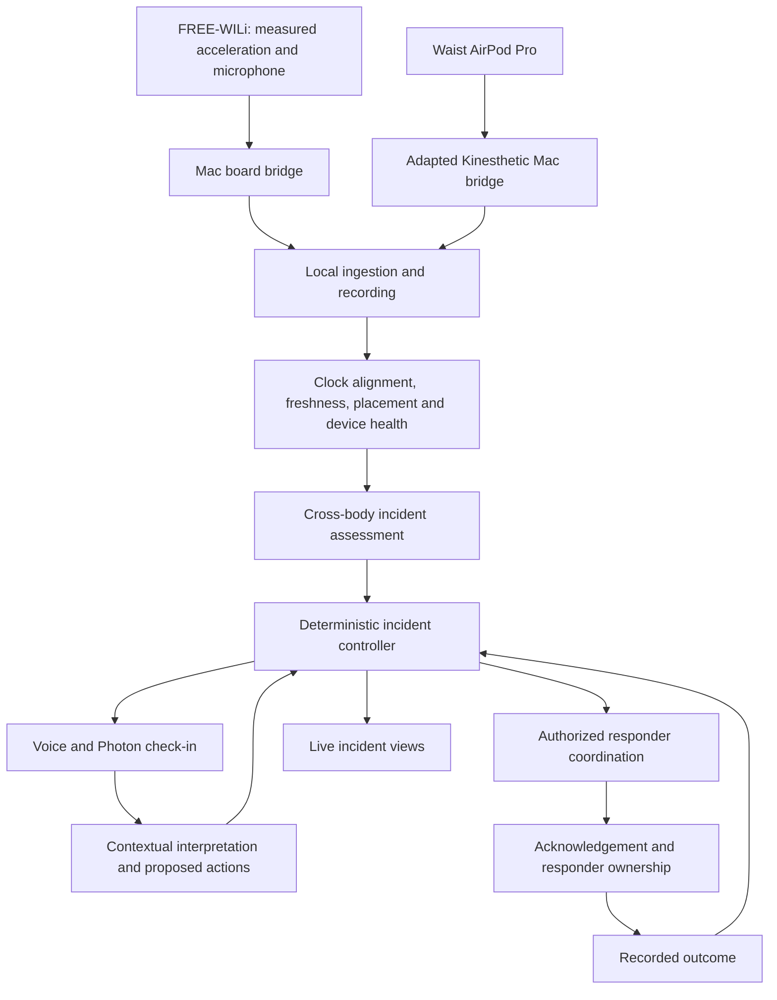

# LIFELINE reference architecture and developer handoff

Prepared 2026-10-03 from source reviews of Nook and Wander, Kinesthetic's native AirPods bridge, and LIFELINE's architectural requirements.

**Product:** LIFELINE follows a suspected physical incident from sensor evidence through verification, authorized responder acceptance, and a recorded outcome. The differentiator is the complete incident-resolution loop. Cross-body sensing supplies additional evidence; its accuracy advantage remains a hypothesis to test.

**Target hardware:** FREE-WILi for primary wearable acceleration and spoken interaction, a waist-mounted AirPod Pro, and the nearby Mac. The iPhone carries Photon/iMessage communication and supplies no sensing or voice input. See the [workshop-grounded migration plan](device-and-record-migration.md) for the device protocol and patient-data design. The existing runtime remains the earlier phone/AirPod implementation until migration is completed.

This document specifies the reference architecture. The local prototype now implements the incident loop and native acquisition clients; see [current setup and validation](../README.md). Live provider integration and fall-detection accuracy still need device trials.

## What the prior projects actually supply

| Source | Reuse | Required change or limit |
| --- | --- | --- |
| Nook: [clock injection](/Users/tazeemmahashin/Downloads/nook-main/src/shared/clock.ts:7) and [event processing](/Users/tazeemmahashin/Downloads/nook-main/src/brain/engine.ts:1330) | Event → decision → action separation, injected time, replayable policy. | Write a stricter incident controller. The existing language boundary can alter safety state. |
| Nook: [fallback parser](/Users/tazeemmahashin/Downloads/nook-main/src/llm/fallback.ts:14) | A concrete regression case. | The word `safe` matches “I'm not safe”; a model-classified `ok` can also resume a check-in. Neither may authorize LIFELINE resolution. |
| Nook: [contact alert](/Users/tazeemmahashin/Downloads/nook-main/src/brain/engine.ts:369) | Action construction. | `contactAlerted` becomes true before delivery. Replace this with persisted action attempts and explicit provider results. |
| Wander: [structured perception](/Users/tazeemmahashin/Downloads/citrus-squad-x-berkeley-hackathon-main/ios/Sources/Perception/PerceptionSnapshot.swift:18) | Observations with source, confidence, and explicit unknown values to ground interpretation. | Add capture time, freshness, and device health to every LIFELINE observation. Navigation and depth assumptions do not transfer automatically. |
| Wander: [central arbitration](/Users/tazeemmahashin/Downloads/citrus-squad-x-berkeley-hackathon-main/ios/Sources/AppModel.swift:859) | One controller chooses the action distributed to output channels. | Incident policy takes priority over narration and general conversation. |
| Wander: [held vision hazard](/Users/tazeemmahashin/Downloads/citrus-squad-x-berkeley-hackathon-main/ios/Sources/Perception/VisionHazardSource.swift:20) and [unknown depth handling](/Users/tazeemmahashin/Downloads/citrus-squad-x-berkeley-hackathon-main/ios/Sources/Perception/ObstacleAvoidance.swift:39) | Failure cases to avoid. | A held detection lacks age-based expiry; unknown depth is treated as open. Missing or stale evidence must remain unknown. |
| Kinesthetic: [native acquisition](/Users/tazeemmahashin/Documents/ChatGPT/Kinesthetic/native/ClubMotionBridge.swift:133) and [relay validation](/Users/tazeemmahashin/Documents/ChatGPT/Kinesthetic/coordinator/golf-relay.ts:259) | Real `CMHeadphoneMotionManager` capture, reporting-bud identity, session IDs, increasing sensor timestamps, finite-value checks, and WebSocket transport. | Export acceleration and gravity as well as orientation and angular velocity; validate useful readings on the actual waist-mounted bud. |
| Kinesthetic: [route keeper](/Users/tazeemmahashin/Documents/ChatGPT/Kinesthetic/native/KeepAlive.swift:5) and [mounted-bud setup](/Users/tazeemmahashin/Documents/ChatGPT/Kinesthetic/native/README.md:19) | Existing work to keep an off-ear motion stream active. | Verify reporting Left/Right identity, continuity, and reconnect behavior in LIFELINE's mount. Treat the measurements in its comments as prior project observations, not new LIFELINE validation. |
| Kinesthetic: [host clock](/Users/tazeemmahashin/Documents/ChatGPT/Kinesthetic/coordinator/hostclock.ts:12) | Monotonic arrival stamps and replay ordering. | Arrival time on one Mac does not establish simultaneous capture on an iPhone and Mac. Preserve both sensor time and receive time, with a clock-offset estimate and uncertainty. |
| Kinesthetic: [dominant-motion selector](/Users/tazeemmahashin/Documents/ChatGPT/Kinesthetic/coordinator/motion-fuse.ts:56) | A useful game-specific design reference. | Do not use it for cross-body assessment: it selects one active source and rebases its orientation. Preserve both raw streams. |

The source findings above were checked in the local files. Reference repositories were not changed. Historical influence or novelty across the wider field has not been established. Detailed Fallyx acknowledgement, severity, duration, and post-fall claims still require the deck or other primary evidence.

## Acquisition topology

Use Kinesthetic's working macOS acquisition path for the initial build:

The Mac is the acquisition/coordination host. One AirPods pair plus the FREE-WILi bridge does not need Kinesthetic's two-pair/two-Mac setup. Keep Kinesthetic's existing off-ear acquisition on macOS. [Apple headphone motion documentation](https://developer.apple.com/documentation/coremotion/cmheadphonemotionmanager)

The existing AirPods packet exports quaternion and rotation rate, not acceleration. `CMDeviceMotion` exposes gravity and user acceleration; add these to the adapter, then check actual values, sample cadence, and continuity. Represent units explicitly and distinguish gravity-inclusive acceleration from user acceleration. Their sum is total acceleration. [Apple device motion documentation](https://developer.apple.com/documentation/coremotion/cmdevicemotion)

Use FREE-WILi's speaker and microphone for the wearer check-in, with host-mediated audio/transcription. A voice prompt routed only to the waist-mounted earbud would fail the interaction. Test simultaneous board audio and both motion streams.

Camera, RGB imagery and LiDAR are out of scope. Motion and wearer statements provide context for this build.

## Observation and assessment contract

Keep separate motion buffers and device-health records for the FREE-WILi primary source and `waist-airpod`. Historical `chest-phone` recordings retain their original identity. Each sample needs:

- Device/source identity, reporting bud where applicable, configured placement, acquisition session ID, and sequence.
- Original monotonic capture time and its clock domain, host receive time, estimated aligned capture time, and alignment uncertainty.
- Measured acceleration with declared units/range/coordinate conventions. Retain quaternion, rotation rate, gravity and user acceleration from the AirPod; unsupported WILi fields are explicitly absent. Any derived gravity/tilt has an identified estimator and validity.
- Calibration/mount version, sample validity, and whether the source is live, recorded replay, or synthetic.

Maintain connection and permission status, sample age, observed cadence, packet gaps, clock quality, and mount/source continuity separately. A sensor reconnect, reporting-bud switch, or remount invalidates the prior calibration. A new session cannot silently inherit old source timing.

The first assessment is an explainable candidate detector. It can examine acceleration peaks, orientation changes relative to each source's calibrated mount, rotation, subsequent motion, and timing agreement. Do not subtract raw device-frame vectors or raw quaternions across mounts without a defined transformation. Begin with magnitude and calibrated orientation features.

The hypothesis is that primary-wearable and waist evidence helps distinguish a bodily fall from an isolated device drop, abrupt sitting, and bending. Two sources can also fail together or disagree because of delay, mount movement, or the reporting bud changing. Agreement is evidence, not a diagnosis or a validated probability.

A fresh single source may open a tentative check-in under explicit policy, labelled as single-source evidence. An unavailable second source cannot supply a negative vote or cancel an existing incident. Sensor loss by itself is a monitoring-health event, not proof that a fall occurred.

## Incident controller

Use one authoritative controller for all state transitions. If Spacetime is the selected backend, persist incident state and action intentions transactionally there; clients and agents submit commands rather than writing phase values. Keep sensor health orthogonal to incident phase.

| Phase | Entry evidence | What permits progress |
| --- | --- | --- |
| `DETECTED` | A candidate with referenced sensor evidence or an authenticated manual help request. | Controller creates the current check-in and deadline. Manual help bypasses the waiting period. |
| `CONFIRMING` | A check-in attempt is recorded. | Explicit help or the persisted deadline leads to `HELP_REQUESTED`. Ambiguous language leaves the incident unresolved and keeps the deadline. |
| `HELP_REQUESTED` | Policy creates an authorized contact attempt. | An eligible responder explicitly accepts the current incident; a sent/delivered notification is insufficient. |
| `ACKNOWLEDGED` | Authenticated acceptance with an atomically assigned owner. | The owner explicitly reports travel or presence. A missed progress deadline triggers the configured follow-up or reassignment. |
| `RESPONDER_EN_ROUTE` | The owner reports being on the way. | The owner records arrival; missing updates invoke policy. |
| `ON_SCENE` | The owner records arrival. | The authorized owner submits a defined outcome and supporting evidence. |
| `RESOLVED` | Accepted outcome record with actor, evidence source, and time. | Terminal for that incident. A subsequent event creates a new incident. |
| `CANCELLED_FALSE_ALARM` | An explicit authenticated cancellation permitted by policy, tied to the current incident/check-in. | Terminal with cancellation provenance. A model-generated `safe` classification cannot create this event. |

For the first version, natural language can request help or trigger clarification. Clearing a check-in requires an explicit authenticated control such as **Cancel this alert — I do not need help**. Replies such as “I'm not safe,” “okay but I can't get up,” “maybe,” or a bare “yes” cannot clear it. Once help has been requested, cancellation follows the configured responder/subject policy and updates everyone already contacted.

All commands carry an event ID, incident ID, relevant check-in/action ID, authenticated actor identity, and expected incident version where needed. Reject stale or unauthorized replies. Deduplicate repeated callbacks. Responder acceptance is atomic: two simultaneous acknowledgements cannot silently create two owners.

Persist deadlines, contact order, permissions, attempts, and state version. Recover overdue deadlines after restart. Keep action status distinct: `queued`, `attempting`, `provider_accepted`, `delivered` where reported, or `failed`. A timeout with an unknown provider result remains unknown. Use provider idempotency or reconciliation before retrying when supported; do not promise exactly-once delivery across arbitrary APIs.

## Where the agent and sponsors fit

The agent interprets context, assembles a source-grounded handoff, proposes eligible responders, and invokes bounded tools. The controller enforces current state, actor permissions, contact order, timeout policy, and resolution evidence. An agent cannot invent a recipient, suppress an unresolved incident, or mark the subject safe.

- **FinchNode:** retrieve the synthetic subject's medications, conditions, and allergies for a concise handoff. Record record IDs/retrieval time and distinguish an absent field, unavailable records, and an explicitly documented negative finding. Record lookup failure must not block requesting help.
- **Photon:** carry the iMessage check-in, authorized contact alert, and correlated replies. It is the communication channel; interpretation and incident policy remain separate.
- **FetchAI:** discover and invoke the constrained coordination agent. If entering this track, implement its required Agentverse/ASI:One/ACP workflow and show the primary workflow in ASI:One, as recorded in the [track research](/Users/tazeemmahashin/Documents/ChatGPT/MHacks/output/research/fetch-track.md). An API call alone does not establish submission eligibility.
- **Spacetime:** synchronize authoritative incident phase, owner, deadlines, action status, and outcome across participant/responder views. Live UI state follows accepted controller events.
- **ElevenLabs:** speak the check-in and grounded handoff through an audible output. Voice failure does not remove the incident or its deadline.

The handoff should state **suspected fall**, detection time, evidence quality, subject response or lack of response, current location with age/accuracy, synthetic health context, and current owner. Separate observed facts, the person's statements, model interpretations, and unknowns. Avoid inferred medical diagnoses.

FREE-WILi replaces the sensing/voice phone under the revised architecture. This does not change the primary track from AI to Hardware. Track eligibility and prize stacking must be checked against the supplied [tracks and prizes PDF](/Users/tazeemmahashin/Documents/ChatGPT/MHacks/output/pdf/MHacks-2026-Tracks-and-Prizes.pdf); the review does not establish that all awards can be combined.

## Build order and acceptance

1. **Capture and record both sources.** Keep the native AirPods bridge, add the FREE-WILi bridge for the actual board/firmware, and expose placement, capabilities, range, source identity, freshness, gaps and clock quality. Demonstrate both moving together and one moving alone before tuning a detector.
2. **Implement and test the controller.** Use injected time, persisted deadlines, correlated commands, an action outbox, and atomic ownership. Test with synthetic incidents while real sensor acquisition is being validated.
3. **Connect one candidate event to one complete response loop.** A physical trigger opens a check-in; silence escalates; a registered teammate accepts; progress and an outcome are recorded. Clearly label any replay or synthetic fixture used during development.
4. **Add source-grounded health and voice.** Make these useful enrichments without letting provider availability govern incident closure or escalation.
5. **Add sponsor-specific entry points.** Complete the actual required workflow, especially ASI:One for FetchAI, then rehearse the same incident end to end.

Meaningful controller regression checks include negated/ambiguous replies, a model returning `safe`, old-incident replies, unauthorized acceptance, concurrent ownership claims, duplicate delivery callbacks, failed delivery/retry, restart during a deadline, late acknowledgements after reassignment, and resolution without required evidence.

Sensor checks include off-ear continuity, reporting-bud change, reconnect/calibration jumps, stale samples, out-of-order packets, unknown acceleration fields, transport delay, clock uncertainty, mount slip, and voice-induced audio-route changes. Record actual delivered cadence; do not assume an AirPods rate or that a short impact is captured.

To evaluate the cross-body hypothesis, record repeatable trials of controlled incident-like motion, isolated WILi drops, abrupt sitting, bending and ordinary movement. Score the same recordings with primary-only, waist-only and combined logic using fixed settings on held-out trials. Report missed candidates, false alerts and detection latency, plus sensor availability and alignment quality. This establishes prototype behavior on those trials, not clinical fall-detection accuracy.

The demo is complete when the physical event leads to an audible check-in, an authorized responder's phone alert, explicit acceptance shown on all views, a progress update, and a sourced final outcome. Merely sending the alert is an intermediate step.

## Developer description

> LIFELINE combines FREE-WILi acceleration and waist AirPod motion evidence with contextual verification and policy-bounded coordination through acknowledgement, responder ownership, and a recorded outcome. Nook informs the event-driven safety and Photon interaction design, Wander/CaneEye inform wearable perception, Kinesthetic provides working AirPods acquisition prior art, and Fallyx informs the broad fall-response workflow. The system follows the incident until an authorized person takes responsibility and its outcome is recorded.

CaneEye and Fallyx are contextual references from the reviewed discussions; their source code and the detailed Fallyx workflow deck were not inspected in this task. This is LIFELINE's reference architecture, not a claim of historical influence or established novelty.
