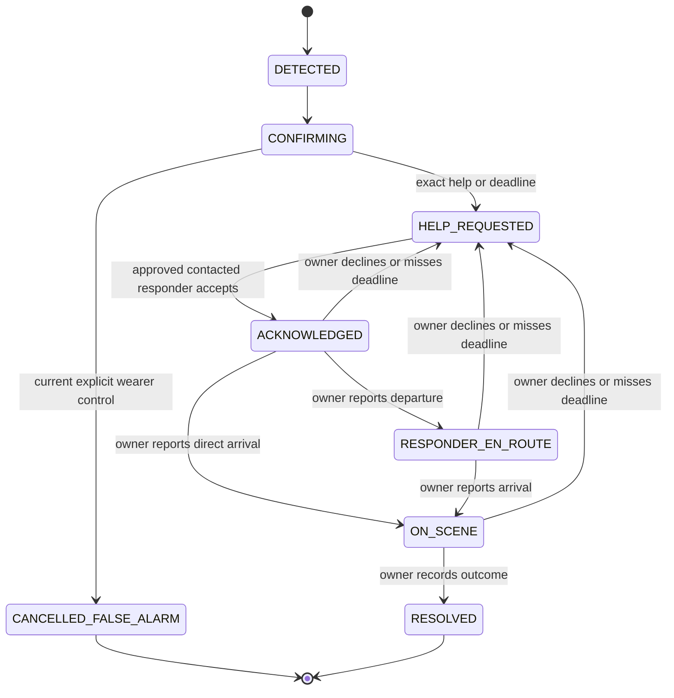

# LIFELINE — Product requirements

Updated: October 4, 2026. Primary track: **Actually Intelligent (AI)**.

## Product

LIFELINE follows a suspected physical incident from motion evidence through a wearer check-in, approved responder coordination, and a recorded outcome. The product promise is follow-through: someone explicitly accepts responsibility, reports progress, and records what happened.

LIFELINE is a care-coordination companion. Read-only Finch records answer what is documented; Photon lets approved people ask questions and report what happens next. Fall-like motion is the first intended trigger for the incident loop. New observations, responder reports and outcomes remain in LIFELINE’s care log and a downloadable brief, separately attributed from hospital records.

**AI handles unstructured information; deterministic software handles the safety policy.** AI selects incident-relevant source facts, composes a grounded handoff, and answers responder questions while distinguishing known facts from unavailable information. Only authenticated, explicit actions and configured deadlines change incident state.

The target hackathon prototype uses **FREE-WILi for primary wearable acceleration and spoken interaction**, a **waist-mounted AirPod Pro**, and a nearby Mac. The **iPhone is the texting/communication channel**; it supplies no sensor, camera, or speech evidence in the target design. The two motion streams provide different body-placement evidence. Whether they improve detection over either sensor alone is a hypothesis to evaluate using recorded trials.

The iPhone app now handles communication only. Structured synthetic records, immutable incident revisions, record Q&A and care-brief export are implemented. The connected original WILi runs stock v54 firmware through the official Python SDK. Acceleration acquisition, physical controls, display updates, a provisional cross-body detector, board PCM prompts and local microphone transcription are implemented; physical performance remains under rehearsal. The [migration plan](device-and-record-migration.md) defines those validation gates. Camera work is removed from scope.

## Users and decisions

| User | Needs to know or do |
| --- | --- |
| Wearer | Hear the check-in, request help, explicitly cancel a false alarm, and see who accepted and what progress they reported. |
| Approved responder | Receive a concise incident handoff, accept or decline, ask about returned synthetic records, report departure/arrival, and record an outcome. |
| Demo operator | Verify sensing and provider readiness, record trials, see the incident timeline and actual action results, and run clearly labelled development simulations. |

The prototype serves one wearer and one active incident, with a configured responder list. It does not enroll real patients or dispatch emergency services.

The demo can use **simulated human dispatch** instead of a second person's phone. Once help is requested, Maya automatically accepts, departs, arrives and records an explicitly simulated outcome through the normal incident state machine. The real product still coordinates human responders through Photon. Demo dispatch is persisted on each new incident and labelled on the dashboard, wearable, wearer messages and care brief. Local simulated receipts never become Photon receipts or measured location. Wearer sensing, speech, clinical retrieval and the actual wearer iMessage channel retain their own sources. No operator performs responder progress during this demo; the existing check-in and explicit wearer controls remain in effect.

## Scope and fixed decisions

| Area | Decision |
| --- | --- |
| Main track | Actually Intelligent (AI). Hardware is not a target track. |
| AirPods acquisition | Directly incorporate Kinesthetic's working Mac acquisition and route keeper. Keep the existing `KeepAlive.swift` unchanged and retain [provenance](../native/PROVENANCE.md). |
| Primary wearable | FREE-WILi acceleration, mic/speaker, buttons and incident display through a Mac bridge. Use the acquired original v54 board through the official stock Python SDK. |
| Phone | Photon/iMessage communication for wearer and responders; no motion, camera or voice acquisition. |
| Host | Nearby Mac runs Node 24, SQLite, detector, persisted incident controller, provider workers, and live web console. |
| Messaging | Photon cloud through Spectrum: wearer check-in plus individual approved-responder conversations. |
| Health | Structured Finch patient view: demographics, medications (including administration/dispense history), conditions, allergies and dated historical vitals. Start with synthetic demo records; sandbox Connect adds explicit wearer/subject binding. Finch is read-only; incident records remain in LIFELINE. |
| Voice | Seven cached 8 kHz mono PCM prompts played by FREE-WILi, with bounded board microphone capture and local Whisper transcription on the Mac after 16 kHz resampling. Preserve the cache's actual generation source; provider configuration does not establish board audibility. Phone speech is removed from the target. |
| AI | Required for the judged AI demo: model composes structured handoffs and answers by selecting incident facts, record IDs/fields, and unavailable information. Application code renders source values and citations. Degraded templates keep response running on failure but do not satisfy the AI demo gate. |
| Deferred | Spacetime migration, Fetch/ASI:One entry point, automatic emergency calling, production patient enrollment, and multiple wearers. Camera perception is out of scope. |

Photon and FinchNode connect clinical context to human follow-through. Finch’s read-only boundary is compatible with the [sponsor criterion](https://safe-banon-80d.notion.site/Tracks-Prizes-3ed24ca0c81b80579aeff03edfa88af5): a working synthetic-record integration that helps patients, clinicians or care teams; writeback is not required. Seven cached board prompts can be explicitly prepared with ElevenLabs or local speech; the manifest records which source generated them. Provider preparation and observed board playback must be verified before an ElevenLabs submission claim. Submission claims must reflect the integrations actually demonstrated. No prize stacking or award amounts are assumed by this PRD.

## Core experience

Before an incident, the operator can read the protected synthetic patient view and ask questions against the displayed revision. An explicit Record context selector switches between the current read and the immutable incident snapshot. The wearer's everyday private Photon conversation and WILi blue-button voice path also accept record questions outside incidents. Clinical requests use the grounded record engine; social replies use the companion model. Every clinical answer identifies the actual fictional subject and explicitly distinguishes it from the wearer's personal record. Each answer saves its original clinical snapshot, source IDs, revision, retrieval time and generation status. Refreshes cannot rewrite that answer's sources. The protected care journal exports the most recent 40 attributed messages with their linked synthetic snapshots; app reports remain separate from read-only hospital facts. During incidents, approved contacted responders retain correlated record Q&A. After an incident, export its source-separated care brief. No automatic hospital writeback or care-plan change is implied.

Daily wellbeing defaults to 2 p.m. in the configured local timezone, with one persisted prompt per date and no late-night catch-up. Wearers reply by text or hold Blue, speak and release. Loneliness or silence does not trigger an incident; explicit help does. Incident response interrupts everyday-care preparation and submission. Social-model input excludes saved clinical answers, and record Q&A receives the hospital snapshot without the wellbeing journal.

1. Both mounted sources stream to the Mac. The operator verifies freshness, reporting AirPod, range/clipping, and clock alignment. Stock WILi timing is gateway receipt timing; board capture latency remains unknown. Standing AirPod tilt calibration is optional.
2. A qualifying motion candidate opens one suspected incident. The evidence states whether it is cross-body, single-source, manual, or synthetic.
3. FREE-WILi speaks its check-in. Photon sends the wearer: **“I detected a possible fall. Are you okay?”** with the incident code and help/cancellation instructions.
4. Both channels share one check-in identity and deadline. Exact help requests escalate immediately. Silence, positive language, and ambiguity preserve the unresolved incident until the deadline. A positive reply directs the wearer to the explicitly labelled **I DON'T NEED HELP** control on FREE-WILi. Board playback or a Photon acknowledgement does not reset the timer. Phone controls are communication actions; board playback/transcription requires physical verification.
5. Before escalation, the wearer can explicitly activate **I DON'T NEED HELP** for the current check-in. A typed or spoken “I'm okay” cannot cancel it.
6. On escalation, the controller contacts approved responders according to policy. Their messages include the handoff and exact commands needed to continue.
7. An approved, contacted responder accepts the correlated alert. First acceptance wins atomically. The wearer and console see that acceptance; departure remains unconfirmed.
8. The owner reports departure or arrival. Other contacts receive truthful updates and remain available for reassignment if necessary.
9. The on-scene owner records a concrete outcome. The controller closes the incident, records the source, and sends the final update.

The wearer can press **I NEED HELP** independently of the detector. That requests help immediately and does not wait for the check-in timeout.

## Patient workspace

The incident dashboard has four primary views: **Motion, Location, Status, Medical**. Motion combines incident dynamics and provisional severity with detailed live WILi acceleration and waist-AirPod telemetry. A manually started check-in does not become a measured fall. Frozen trigger measurements are separate from current readings and saved outcomes.

Location contains one interactive cutaway exported from Apartment_111_Final.blend, including its supplied person on the kitchen floor, plus consented shared positions and approach estimates. Orbit, zoom, overhead and person-focused views use the same scene. A blue radiating marker highlights the model person placement; it does not establish live indoor tracking. Building, floor, room and access instructions can be entered as browser-tab notes; these notes are not yet relayed to responders or inferred from GPS. Status separates recorded wearer replies from a labelled, presentation-only watch/caregiver fixture. Mock observations never enter policy, messages or hospital records. Medical prioritizes cited medications, allergies and conditions, retains dated historical vitals and local incident history, and leaves DNR/code status unknown when absent from the source. Conversation, audit, connections and developer controls are secondary workspace tools. Existing overview and care links remain compatible.

The dedicated `/ehr` workspace organizes the read-only chart into Care context, Medications, Vitals, Care log and Complete record. Medication status retains current, historical and unknown groups, including administration and dispense history. Vital charts include only actual numeric values with valid measurement dates and matching units; incomplete rows remain available as literal source records. Current readings never replace a selected incident snapshot. Record questions use the displayed revision and discard stale completions after a context change.

The wearer care log remains visibly separate from the fictional Finch subject. It includes daily conversation, exact incident reports, ownership, recorded outcomes and captured wearable measurements with timing quality. These observations do not become hospital records or live clinical vitals. A protected care-record export includes both the selected chart and the original snapshots behind incident handoffs and clinical conversation answers, labelled by source. The EHR page has no incident controls or messaging actions.

## Incident policy

Normal configurable defaults: **20-second check-in, 60-second acceptance window, 120-second owner progress window**. The explicit hackathon profile (`npm run start:demo` or `LIFELINE_DEMO_MODE=1`) sets a five-second timeout for newly created check-ins. Timing details show the effective and configured durations under Advanced. Product screens and spoken messages use normal LIFELINE wording. Restart never changes an existing persisted deadline.

The five-second profile demonstrates silence → deadline → escalation. The cached board check-in says “I detected a possible fall. Do you need help?”; the companion iMessage asks “Are you okay?” A spoken positive-reply rehearsal uses a sufficient configurable window for playback, bounded listening, recognition, and acknowledgement. Neither playback nor acknowledgement extends the original deadline. Actual provider latency, board playback and bridge polling/transport cadence must be measured before relying on the five-second profile.

Each contact round selects up to the first two eligible responders in configured order. Exhausting the list leaves the incident unresolved and visibly unassigned.

Arrival can be reported directly from acceptance: someone already beside the wearer should not have to invent a departure. A contacted non-owner can decline. Only the current owner can report progress or resolve.

Resolution records a responder's reported outcome, actor, and time. It is not independent confirmation of a diagnosis or of the wearer's physical safety.

## Functional requirements

All requirements below are P0 unless marked P1. “P0” means required for the intended live demo; implementation and validation are separate gates.

| ID | Requirement | Acceptance evidence |
| --- | --- | --- |
| S1 | Preserve both real motion streams with source, reporting bud where applicable, session, sequence, capture/receive timing, measured capabilities and units. WILi packets preserve gravity-inclusive acceleration/range; AirPod packets retain fused motion fields. Do not fabricate unsupported fields. | Separate live source views and increasing received sample counts; invalid/out-of-order packets rejected and saturation visible. |
| S2 | Preserve freshness, cadence, timing basis and alignment in sensor details. WILi's main card starts with a labelled zero and retains its last measured reading between reports; quiet intervals show Idle. This display memory never feeds detection or calibration. AirPod standing tilt calibration is optional; reconnect, reporting-bud changes and substantial gaps invalidate that baseline. WILi does not report fused orientation. | Sensor details preserve stale/unknown acquisition state until fresh aligned measurements resume; tilt remains unknown until optionally recalibrated. Presentation tests verify that held readings do not become detector evidence. |
| S3 | Cross-body assessment uses WILi acceleration, correlated waist movement/rotation and continuous waist quiet. Stock host-receipt timing is disclosed rather than presented as acquisition time. Thresholds remain provisional: ≥1.65 g for the stock ±2 g profile; clipping is excluded. | A complete recorded staged-event trial reproduces the candidate offline without fabricated gyro/gravity values. |
| S4 | The current WILi assessment requires both usable streams; it has no single-source fallback. A fresh waist lacking valid alignment cannot supply cross-body evidence. Tilt calibration is not required for its movement/rotation features. | Controlled fixtures and recorded degraded trials preserve unknown evidence; missing data never establishes safety. |
| C1 | Keep one active incident, deterministic transitions, audit events, and persisted deadlines. Repeated triggers cannot restart its check-in budget. | Injected-clock and restart tests. |
| C2 | Issue FREE-WILi audio and wearer iMessage for the same check-in. A slow wearer send cannot block responder escalation. | Observe board playback and wearer receipt; independent worker tests and simultaneous motion/audio measurement. |
| C3 | Correlate replies and controls to current IDs. Exact help escalates; positive replies acknowledge and direct the wearer to the explicit control. Positive/ambiguous language cannot cancel or extend the deadline. | Spoken/iMessage help, positive, negated, ambiguous, and duplicate cases; stale explicit targets remain invalid even with a current code. |
| C4 | Require explicit current wearer cancellation before escalation; after escalation require the on-scene owner's outcome. | Late/stale cancellation and premature resolution are rejected. |
| R1 | Contact only approved configured identities, distinguish send outcome from acceptance, and assign one owner atomically. | Actual alert receipt, authorized/competing acceptance, stale tapbacks, Apple-ID/suffix identity rejection, and supplied reaction-removal events preserving ownership. General Photon removal delivery remains unverified. |
| R2 | Actionable alerts and phase updates explain the next permitted exact command. Acceptance must not imply departure; context-only handoffs/answers must not repeat obsolete commands. | A teammate completes the loop using only the received messages. |
| R3 | Handle decline, missed acceptance, and missed owner progress without clearing the incident. | Reassignment tests and a rehearsed unavailable-owner branch. |
| A1 | AI must select incident-relevant facts, compose a grounded handoff, and answer free-form responder questions using incident observations and returned synthetic records. Separate known source facts from unavailable information. It cannot diagnose, prescribe, invent facts, cancel, assign responsibility, or change phase. | At least one real model-generated handoff and impressive responder answer with source IDs. Inspect claims against source fields; invalid output visibly degrades to a template and does not pass the AI gate. |
| A2 | Persist the original approved responder question before generation, then the correlated outgoing answer, provenance and delivery attempts. Prepare answers outside the inbound listener with bounded attempts and recover interrupted jobs. Duplicate questions cannot create duplicate replies. Recheck permission before submission; discard answers if phase changes during preparation or queueing. | Failed, unknown, duplicate, stale, interrupted preparation, timeout, shutdown, rollback/restart and incident-changed-during-answer tests. |
| A3 | Recover Photon inbound listening after initial connection failure or stream interruption, with bounded retry and clean shutdown. | Offline reconnect/end/error tests; live disruption rehearsal when configured. |
| D1 | Show phase, owner, reported progress, outcome, readable handoff, paired responder questions/answers, per-answer provenance, source health, and action attempts on the console. Offer a labelled local answer preview that sends no message and does not change incident history. | Views agree with controller state throughout the same incident; preview leaves phase, timeline, and outbox unchanged. |
| D2 | Keep synthetic triggers, operator impersonation controls, locally prepared fallback board voice, and replay visibly labelled. | Demo reviewer can identify which evidence is physical and which is simulated, and which provider generated the cached audio. |
| D3 | Label the accelerated five-second demo profile and the configured normal policy. Never replace an existing incident's persisted deadline when changing profile. | Console/phone show effective timing; new incidents use the profile while an existing deadline survives restart. |
| D4 | Display structured clinical rows and dated historical vitals with subject, status, source IDs, source dates, retrieval time and category availability. Keep sensor evidence, wearer statements, responder reports and AI artifacts distinguishable. | Every shown fact can be traced to its source; historical vitals are never labelled current. Clinical context revisions do not silently rewrite older handoffs. |
| E1 | Record samples, capabilities/range, clocks, calibration, assessments, gaps, and trial boundaries; replay combined/primary-only/waist-only modes offline. Preserve legacy chest-phone captures under their original identity. | Download a complete JSONL trial and compare all three modes without sends. |
| P1 | Compare held-out recorded movements against tuning trials and report candidate counts, misses, false alerts, and latency. | Results include trial definitions and missing/unscored evidence; no clinical accuracy claim. |

## Messaging contract

Use the full current incident code, for example `LF-1234ABCD`.

| Sender/context | Interaction | Result |
| --- | --- | --- |
| Wearer, current check-in | Reply “I need help” to its Photon message, or send `I NEED HELP LF-1234ABCD` | Request help immediately. |
| Wearer, current check-in | Positive speech or iMessage | Acknowledge and direct them to tap I DON'T NEED HELP. Preserve incident and deadline. A Photon acknowledgement is persisted and can receive a correlated help reply. |
| Wearer, current check-in | Ambiguous speech or iMessage | Preserve incident and deadline; no inferred cancellation. |
| Contacted responder, unassigned incident | 👍 on the persisted current alert, or `ON IT LF-1234ABCD` | Accept responsibility if eligible and still unassigned. |
| Assigned owner | `DEPART LF-1234ABCD` | Record departure. |
| Assigned owner | `ARRIVED LF-1234ABCD` | Record arrival from accepted/en-route state. |
| Contacted responder | `DECLINE LF-1234ABCD` | Record decline; if owner, return responsibility to unassigned. |
| On-scene owner | `RESOLVED LF-1234ABCD <concrete outcome>` | Record outcome and close. |
| Current eligible contacted responder | Record question in the current conversation | Queue a source-grounded reply; stale explicit targets/codes cannot refer to a different incident. |

Exact replies to a current bound alert/status also support “on it”/“I can help,” “on my way”/“I’m leaving,” “I’m here”/“arrived,” “I can’t help,” and “resolved: <outcome>.” An explicit stale reply target remains invalid even with a current incident code. Broader language, future plans, negated statements and ETAs do not change state. A model cannot infer authority or perform these transitions.

## Failure behavior and data

- The controller alone changes phase. Sensor readings, language, provider availability, and model text cannot clear an incident.
- Sensor loss is unknown evidence. It does not resolve an existing incident or extend its deadline.
- Device connection attempts must time out and recover. Local acceleration and completed writes must not be presented as proof of dashboard receipt.
- An outbox result of `provider_accepted` establishes provider submission only. Actual phone receipt requires observation; responsibility requires explicit acceptance.
- A confirmed pre-submission failure can retry within policy. An interrupted or uncertain submission remains `unknown`; it is not blindly resent.
- Cancellation/phase changes invalidate obsolete pending actions. A final permission check occurs after DM preparation and before submission.
- FinchNode, AI, audio, and Photon failures must remain visible and must not stop the controller's deadlines. An unavailable record is not evidence that a medication, condition, or allergy is absent.
- Location comes from explicitly granted native Photon Find My sharing, or the optional scoped browser fallback. Captured time, accuracy and incident ownership determine whether a position can support a walking ETA. Missing sharing or insufficient measurements leaves location/ETA unknown. Coordinates never establish responder acceptance, arrival or resolution; simulated dispatch supplies no invented GPS or ETA.
- Tokens, provider credentials, phone numbers, raw recordings, and build outputs stay out of source control and public logs. The current operator token and read-only LAN console are development access, not production identity/enrollment.
- Stopping a trial leaves incident response running. A development reset is recorded as an operator action, never as a safety determination.

## Success criteria and demo gate

The intended demo is about 90 seconds: show the two streams, a controlled candidate, the audible and iMessage wearer check-ins, silence or an exact help request causing escalation, an attributed handoff, acceptance, progress and a recorded outcome. The current profile uses a clearly labelled simulated human dispatcher. A separate live profile uses actual approved responder conversations.

After setup and arming, the judged demo must complete without a dashboard operator. Physical sensing starts the incident; the backend automatically runs check-in, deadlines, escalation, context composition, message relay, wearable updates and follow-up. The wearer interacts through WILi or their phone. In the simulated profile, Maya follows the normal state machine with simulated receipts and outcomes; in the live profile, the authorized human responder acts through their actual Photon conversation. Spectrum/Photon carries the live conversations; the LIFELINE backend owns incident orchestration. The dashboard observes the loop. Development trigger, impersonation and resolution controls do not satisfy this autonomous-demo gate.

Before calling it a live end-to-end demo, establish:

1. Both mounted sources remain usable through a complete rehearsal, including board audio. Measure actual cadence, gaps, saturation and clock uncertainty rather than assuming the requested rates.
2. A recorded physical candidate starts the response loop. Test an isolated WILi drop separately; report its observed result rather than promising rejection before validation.
3. The wearer hears FREE-WILi and receives the actual Photon check-in. Silence preserves the original configured timeout; exact help bypasses it.
4. The selected dispatch profile receives the handoff. Acceptance is visible across views, later progress is explicit, and the owner's final outcome is persisted. A live-responder claim additionally requires actual alert receipt and acceptance from an approved phone; simulated actions remain labelled throughout.
5. AI composes the grounded handoff and answers one correlated record question with source record IDs and explicit unknowns. Observe actual phone receipt separately from the persisted outbound result when claiming live messaging. A template fallback does not pass this AI gate.
6. One injected failure or stale/duplicate input demonstrates the policy boundary without silently resolving or duplicating the incident.
7. A full backup recording exists. If using an operator trigger or recorded replay, identify it clearly and limit the sensing claim accordingly.

Report detection-to-check-in, deadline-to-help-request, actual message receipt, acceptance, and resolution timings as separate measurements. Availability and missed evidence belong beside the candidate results. Do not infer a cross-body accuracy gain from synthetic fixtures or from an average sample rate.

## Current implementation and remaining work

Implemented: the existing waist-AirPod acquisition and unchanged route keeper; the official stock WILi SDK bridge, explicit timing/quality checks, acceleration recording, help/cancel controls, a provisional cross-body assessment, physical incident display, cached PCM speech and bounded local Whisper transcription; communication-only iPhone client; deterministic SQLite incident loop and outbox; native Photon chat/line binding and threaded replies; constrained owner progress and wearer status updates; structured Finch synthetic record view; persisted immutable incident clinical revisions; grounded Q&A before and during incidents; per-handoff generation provenance; and a care-brief export separating hospital records from local reports.

The default runtime disables chest-phone ingestion and phone speech. WILi acquisition quality is visible and feeds a provisional cross-body assessment. The stock bridge requires no firmware flash; custom transport is a separate optional path. The wearer confirmed intelligible ElevenLabs board playback, and local Whisper recognized an actual “I need help” microphone reply. Acceleration reporting pauses during playback and resumes before listening; the gap is visible. Mounted physical sensor trials, Photon receipt/replies and sandbox Connect subject binding remain verification gates. Standing tilt calibration is optional and does not block this detector. Historical iPhone/AirPod recordings and the legacy detector remain source-correct reference data behind an explicit legacy flag, not evidence for the new device setup.

Local AI rehearsal and automated provider fixtures validate grounding and workflow behavior; they do not establish phone receipt. The fictional Finch subject is visibly separate from the real wearer. Persisted synthetic revisions do not establish production consent, revocation or retention behavior.

Development priority is the autonomous wearer-to-resolution demo. The current demo profile uses a clearly labelled simulated human dispatcher, automatically accepting and reporting progress from the local alert. It needs no second phone or dashboard responder clicks. Simulated receipts and outcomes do not establish a real responder's iMessage delivery, GPS, ETA or physical attendance. The live profile retains approved human contacts for a separate rehearsal.

The live validation chain remains:

1. A real Photon check-in reaches the wearer.
2. A physical trigger starts the incident.
3. Silence escalates at the labelled deadline.
4. A real approved responder receives the AI-grounded alert.
5. The responder accepts.
6. Wearer, responder, and console see ownership.
7. AI answers one impressive, source-grounded question on the responder's phone.
8. The responder reports progress and records the outcome.

Measure mounted streams and reachability to support this chain. Record comparison trials and the submission rehearsal after it works. Further reconciliation, teardown, and obscure edge-case work waits behind the complete live demo.

See [development plan](development-plan.md), [native setup](native-setup.md), [interfaces](interfaces.md), [providers](providers.md), [motion trials](motion-trials.md), and [reference architecture](LIFELINE-reference-architecture.md) for implementation details.

### Sensor-space motion lab and unusual movement

The landing links to `/motion-lab`: the supplied apartment with an articulated sensor proxy, chest/waist placements, scrubbed fall, rhythmic-shaking and gait scenarios, clipping readout and synthetic trace export. The source person is unrigged. Optional Rigify preparation/generation and animated-anchor export scripts are included and unexecuted. See [offline motion lab](digital-twin/README.md). Synthetic traces are excluded from live ingestion, calibration, training and threshold selection.

Live fall gates remain unchanged. A fresh continuous four-second cross-body pattern of sustained alternating movement opens a check-in labelled unusual movement / possible seizure-like motion. It is exploratory, not a clinical seizure diagnosis. A current explicit first-person seizure report through the existing wearer voice/conversation channel requests help and records its exact source and words before alert composition. Ambiguous, historical and negated reports preserve uncertainty; current sensor absence cannot establish safety. Gait trends shown by the lab are illustrative only.
