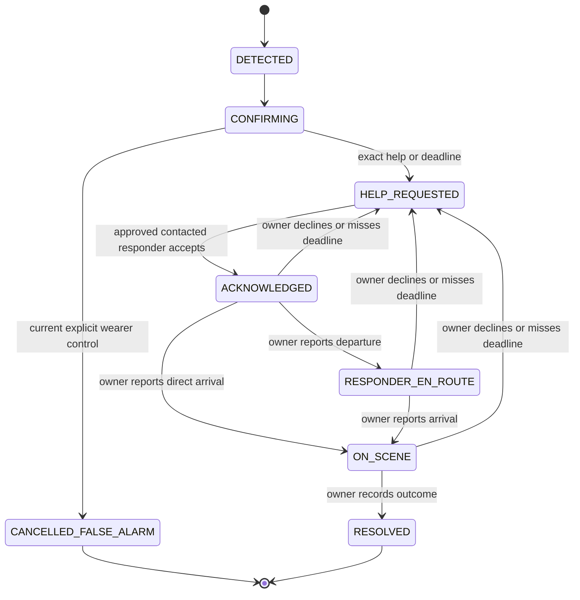

# LIFELINE — Product requirements

Updated: October 3, 2026. Primary track: **Actually Intelligent (AI)**.

## Product

LIFELINE follows a suspected physical incident from motion evidence through a wearer check-in, approved responder coordination, and a recorded outcome. The product promise is follow-through: someone explicitly accepts responsibility, reports progress, and records what happened.

LIFELINE is an incident-response product. Fall-like motion is the prototype trigger for a broader response loop. Detection supplies evidence that something may have happened; verification, explicit responder ownership, and recorded resolution are the core product responsibilities.

**AI handles unstructured information; deterministic software handles the safety policy.** AI selects incident-relevant source facts, composes a grounded handoff, and answers responder questions while distinguishing known facts from unavailable information. Only authenticated, explicit actions and configured deadlines change incident state.

The hackathon prototype uses a **chest-mounted iPhone 15**, a **waist-mounted AirPod Pro**, and a nearby Mac. The two motion streams provide different body-placement evidence. Whether they improve detection over either sensor alone is a hypothesis to evaluate using recorded trials.

## Users and decisions

| User | Needs to know or do |
| --- | --- |
| Wearer | Hear the check-in, request help, explicitly cancel a false alarm, and see who accepted and what progress they reported. |
| Approved responder | Receive a concise incident handoff, accept or decline, ask about returned synthetic records, report departure/arrival, and record an outcome. |
| Demo operator | Verify sensing and provider readiness, record trials, see the incident timeline and actual action results, and run clearly labelled development simulations. |

The prototype serves one wearer and one active incident, with a configured responder list. It does not enroll real patients or dispatch emergency services.

## Scope and fixed decisions

| Area | Decision |
| --- | --- |
| Main track | Actually Intelligent (AI). Hardware is not a target track. |
| AirPods acquisition | Directly incorporate Kinesthetic's working Mac acquisition and route keeper. Keep the existing `KeepAlive.swift` unchanged and retain [provenance](../native/PROVENANCE.md). |
| Phone | Native SwiftUI app: real Core Motion, speaker, on-device English speech recognition, and explicit wearer controls. Monitoring requires the foreground. |
| Host | Nearby Mac runs Node 24, SQLite, detector, persisted incident controller, provider workers, and live web console. |
| Messaging | Photon cloud through Spectrum: wearer check-in plus individual approved-responder conversations. |
| Health | FinchNode's fixed synthetic `patient-demo-001` medications, conditions, and allergies. No live patient mapping. |
| Voice | A cached ElevenLabs check-in clip; visibly identified native phone speech when provider audio is unavailable during development. |
| AI | Required for the judged AI demo: model composes structured handoffs and answers by selecting incident facts, record IDs/fields, and unavailable information. Application code renders source values and citations. Degraded templates keep response running on failure but do not satisfy the AI demo gate. |
| Deferred | Spacetime migration, Fetch/ASI:One entry point, camera perception, FREE-WILi, new wearable hardware, automatic emergency calling, and multiple wearers. |

Photon, FinchNode, and ElevenLabs each have a concrete role in this same incident. Submission claims must reflect the integrations actually demonstrated. No prize stacking or award amounts are assumed by this PRD.

## Core experience

1. Both mounted sources stream to the Mac. The operator verifies freshness, reporting AirPod, calibration, and clock alignment.
2. A qualifying motion candidate opens one suspected incident. The evidence states whether it is cross-body, single-source, manual, or synthetic.
3. The phone speaks its check-in. Photon sends the wearer: **“I detected a possible fall. Are you okay?”** with the incident code and help/cancellation instructions.
4. Both channels share one check-in identity and deadline. Exact help requests escalate immediately. Silence, positive language, and ambiguity preserve the unresolved incident until the deadline. A positive reply receives: **“Glad you're okay. To close this check-in, tap 'I DON'T NEED HELP' on your phone.”** The phone speaks it after a positive spoken reply; Photon queues it after a positive wearer iMessage. It does not reset the timer.
5. Before escalation, the wearer can explicitly tap **I DON'T NEED HELP** for the current check-in. A typed or spoken “I'm okay” cannot cancel it.
6. On escalation, the controller contacts approved responders according to policy. Their messages include the handoff and exact commands needed to continue.
7. An approved, contacted responder accepts the correlated alert. First acceptance wins atomically. The wearer and console see that acceptance; departure remains unconfirmed.
8. The owner reports departure or arrival. Other contacts receive truthful updates and remain available for reassignment if necessary.
9. The on-scene owner records a concrete outcome. The controller closes the incident, records the source, and sends the final update.

The wearer can press **I NEED HELP** independently of the detector. That requests help immediately and does not wait for the check-in timeout.

## Incident policy

Normal configurable defaults: **20-second check-in, 60-second acceptance window, 120-second owner progress window**. The explicit hackathon profile (`npm run start:demo` or `LIFELINE_DEMO_MODE=1`) sets **DEMO_CHECKIN_TIMEOUT = 5 seconds** for newly created check-ins. The console and phone display **“Demo timeout accelerated from configurable policy value”** with the effective and configured durations. Restart never changes an existing persisted deadline.

The five-second profile demonstrates silence → deadline → escalation and uses the short spoken prompt “I detected a possible fall. Are you okay?” A spoken positive-reply rehearsal uses a sufficient configurable window for playback, recognition, and acknowledgement. Neither playback nor acknowledgement extends the original deadline. Actual provider latency and the phone's polling cadence must be measured before relying on the five-second profile.

Each contact round selects up to the first two eligible responders in configured order. Exhausting the list leaves the incident unresolved and visibly unassigned.

Arrival can be reported directly from acceptance: someone already beside the wearer should not have to invent a departure. A contacted non-owner can decline. Only the current owner can report progress or resolve.

Resolution records a responder's reported outcome, actor, and time. It is not independent confirmation of a diagnosis or of the wearer's physical safety.

## Functional requirements

All requirements below are P0 unless marked P1. “P0” means required for the intended live demo; implementation and validation are separate gates.

| ID | Requirement | Acceptance evidence |
| --- | --- | --- |
| S1 | Preserve both real motion streams with source, reporting bud, session, sequence, capture/receive timing, gravity, acceleration, and angular velocity. | Two separate live traces and increasing received sample counts; invalid/out-of-order packets rejected. |
| S2 | Show freshness, cadence, calibration, and alignment. Reconnect, reporting-bud changes, and substantial gaps invalidate prior calibration. | Disconnect/reconnect trial shows stale/unknown state and requires recalibration. |
| S3 | Cross-body assessment uses aligned chest impact, waist posture, and continuous quiet motion. Thresholds remain provisional. | A complete recorded staged-event trial reproduces the candidate offline. |
| S4 | When the waist is unavailable, permit explicitly labelled chest-only assessment. A fresh waist lacking calibration/alignment cannot supply cross-body evidence. | Controlled fixtures and recorded degraded trials show the evidence kind; missing data never establishes safety. |
| C1 | Keep one active incident, deterministic transitions, audit events, and persisted deadlines. Repeated triggers cannot restart its check-in budget. | Injected-clock and restart tests. |
| C2 | Issue phone audio and wearer iMessage for the same check-in. A slow wearer send cannot block responder escalation. | Observe phone playback and wearer receipt; independent worker tests. |
| C3 | Correlate replies and controls to current IDs. Exact help escalates; positive replies acknowledge and direct the wearer to the explicit control. Positive/ambiguous language cannot cancel or extend the deadline. | Spoken/iMessage help, positive, negated, ambiguous, and duplicate cases; stale explicit targets remain invalid even with a current code. |
| C4 | Require explicit current wearer cancellation before escalation; after escalation require the on-scene owner's outcome. | Late/stale cancellation and premature resolution are rejected. |
| R1 | Contact only approved configured identities, distinguish send outcome from acceptance, and assign one owner atomically. | Actual alert receipt, authorized/competing acceptance, stale tapbacks, Apple-ID/suffix identity rejection, and supplied reaction-removal events preserving ownership. General Photon removal delivery remains unverified. |
| R2 | Actionable alerts and phase updates explain the next permitted exact command. Acceptance must not imply departure; context-only handoffs/answers must not repeat obsolete commands. | A teammate completes the loop using only the received messages. |
| R3 | Handle decline, missed acceptance, and missed owner progress without clearing the incident. | Reassignment tests and a rehearsed unavailable-owner branch. |
| A1 | AI must select incident-relevant facts, compose a grounded handoff, and answer free-form responder questions using incident observations and returned synthetic records. Separate known source facts from unavailable information. It cannot diagnose, prescribe, invent facts, cancel, assign responsibility, or change phase. | At least one real model-generated handoff and impressive responder answer with source IDs. Inspect claims against source fields; invalid output visibly degrades to a template and does not pass the AI gate. |
| A2 | Persist the original responder question, correlated outgoing answer, generation provenance, and delivery attempts. Duplicate inbound questions cannot create duplicate reply actions. Recheck permission immediately before submission; discard answers if phase changes during preparation or queueing. | Failed, unknown, duplicate, stale, rollback/restart, and incident-changed-during-answer tests. |
| A3 | Recover Photon inbound listening after initial connection failure or stream interruption, with bounded retry and clean shutdown. | Offline reconnect/end/error tests; live disruption rehearsal when configured. |
| D1 | Show phase, owner, reported progress, outcome, readable handoff, paired responder questions/answers, per-answer provenance, source health, and action attempts on the console. Offer a labelled local answer preview that sends no message and does not change incident history. | Views agree with controller state throughout the same incident; preview leaves phase, timeline, and outbox unchanged. |
| D2 | Keep synthetic triggers, operator impersonation controls, native fallback voice, and replay visibly labelled. | Demo reviewer can identify which evidence is physical and which is simulated. |
| D3 | Label the accelerated five-second demo profile and the configured normal policy. Never replace an existing incident's persisted deadline when changing profile. | Console/phone show effective timing; new incidents use the profile while an existing deadline survives restart. |
| E1 | Record samples, clocks, calibration, assessments, gaps, and trial boundaries; replay combined/chest-only/waist-only modes offline. | Download a complete JSONL trial and compare all three modes without sends. |
| P1 | Compare held-out recorded movements against tuning trials and report candidate counts, misses, false alerts, and latency. | Results include trial definitions and missing/unscored evidence; no clinical accuracy claim. |

## Messaging contract

Use the full current incident code, for example `LF-1234ABCD`.

| Sender/context | Interaction | Result |
| --- | --- | --- |
| Wearer, current check-in | Reply “I need help” to its Photon message, or send `I NEED HELP LF-1234ABCD` | Request help immediately. |
| Wearer, current check-in | Positive speech or iMessage | Acknowledge and direct them to tap I DON'T NEED HELP. Preserve incident and deadline. A Photon acknowledgement is persisted and can receive a correlated help reply. |
| Wearer, current check-in | Ambiguous speech or iMessage | Preserve incident and deadline; no inferred cancellation. |
| Contacted responder, unassigned incident | 👍 on the persisted current alert, or `ON IT LF-1234ABCD` | Accept responsibility if eligible and still unassigned. |
| Assigned owner | `DEPART LF-1234ABCD` | Record departure. |
| Assigned owner | `ARRIVED LF-1234ABCD` | Record arrival from accepted/en-route state. |
| Contacted responder | `DECLINE LF-1234ABCD` | Record decline; if owner, return responsibility to unassigned. |
| On-scene owner | `RESOLVED LF-1234ABCD <concrete outcome>` | Record outcome and close. |
| Current eligible contacted responder | Record question in the current conversation | Queue a source-grounded reply; stale explicit targets/codes cannot refer to a different incident. |

General natural-language ETAs or declines are outside this version. A model is not allowed to turn an inferred intent into acceptance, departure, arrival, or closure.

## Failure behavior and data

- The controller alone changes phase. Sensor readings, language, provider availability, and model text cannot clear an incident.
- Sensor loss is unknown evidence. It does not resolve an existing incident or extend its deadline.
- Phone connection attempts must time out and recover. Local acceleration and completed socket writes must not be presented as proof of dashboard receipt.
- An outbox result of `provider_accepted` establishes provider submission only. Actual phone receipt requires observation; responsibility requires explicit acceptance.
- A confirmed pre-submission failure can retry within policy. An interrupted or uncertain submission remains `unknown`; it is not blindly resent.
- Cancellation/phase changes invalidate obsolete pending actions. A final permission check occurs after DM preparation and before submission.
- FinchNode, AI, audio, and Photon failures must remain visible and must not stop the controller's deadlines. An unavailable record is not evidence that a medication, condition, or allergy is absent.
- Location is currently **not provided**. The app must not invent a room, address, GPS fix, or responder ETA.
- Tokens, provider credentials, phone numbers, raw recordings, and build outputs stay out of source control and public logs. The current operator token and read-only LAN console are development access, not production identity/enrollment.
- Stopping a trial leaves incident response running. A development reset is recorded as an operator action, never as a safety determination.

## Success criteria and demo gate

The intended demo is about 90 seconds: show the two streams, a controlled candidate, the audible and iMessage wearer check-ins, silence causing escalation, real responder receipt and acceptance, a sourced question/answer, progress, and a recorded outcome.

Before calling it a live end-to-end demo, establish:

1. Both mounted sources remain usable through a complete rehearsal, including phone audio. Measure actual cadence, gaps, and clock uncertainty rather than assuming the requested rates.
2. A recorded physical candidate starts the response loop. Test a phone-only drop separately; report its observed result rather than promising rejection before validation.
3. The wearer hears the phone and receives the actual Photon check-in. Silence preserves the original configured timeout; exact help bypasses it.
4. Approved responder phones receive the handoff. Acceptance is visible across views, later progress is explicit, and the owner's final outcome is persisted.
5. AI composes the grounded handoff and answers one correlated responder question with source record IDs and explicit unknowns. Observe answer receipt on the phone and its persisted outbound result separately. A template fallback does not pass this AI gate.
6. One injected failure or stale/duplicate input demonstrates the policy boundary without silently resolving or duplicating the incident.
7. A full backup recording exists. If using an operator trigger or recorded replay, identify it clearly and limit the sensing claim accordingly.

Report detection-to-check-in, deadline-to-help-request, actual message receipt, acceptance, and resolution timings as separate measurements. Availability and missed evidence belong beside the candidate results. Do not infer a cross-body accuracy gain from synthetic fixtures or from an average sample rate.

## Current implementation and remaining work

The repository implements the native producers, tentative detector, trial/replay tools, SQLite incident loop, console, final on-device reply policy, dual wearer check-in actions, grounded synthetic health, and provider adapters. The iPhone 15 app is signed, installed, and privately paired. A complete 120-second connectivity recording captured 12,019 real chest-phone samples at 100.14 Hz and 5,674 Right AirPod samples at 47.28 Hz through the wired development connection. Maximum received gaps were 81 ms and 127 ms respectively. Placement was unverified and neither source was calibrated, so this establishes simultaneous streaming rather than mounted detection. Mounted sensing and calibration are deferred until the user is ready.

Responder alerts/updates include exact workflow commands. AI context generation, positive wearer acknowledgements, the demo profile, durable answers, and Photon recovery have automated checks. Local Qwen2.5 3B inference has produced a validated handoff covering medications, conditions, and allergies with source IDs, and a focused allergy answer in the running console. Schema-constrained plans and application validation reject invented fields and omitted available categories. Physical voice behavior and actual message receipt still need rehearsal. If Spectrum cleanup never completes, recovery reports the incomplete teardown and blocks replacement clients; it cannot forcibly cancel the SDK.

The console now displays readable handoffs and pairs each recorded responder question with its answer, generation provenance, and delivery result. Its authenticated local AI preview uses the same generation adapter without sending a message or changing incident history. The updated wearer app shows check-in progress, responder ownership, outcomes, and explicit last-known status when disconnected. Photon wearer/responder receipt, reactions and replies, and ElevenLabs playback still require configuration and direct validation; local AI previews do not establish responder receipt. A configured flag is not a demo pass.

The concept is fixed. Development priority is the visible live chain:

1. A real Photon check-in reaches the wearer.
2. A physical trigger starts the incident.
3. Silence escalates at the labelled deadline.
4. A real approved responder receives the AI-grounded alert.
5. The responder accepts.
6. Wearer, responder, and console see ownership.
7. AI answers one impressive, source-grounded question on the responder's phone.
8. The responder reports progress and records the outcome.

Measure mounted streams and reachability to support this chain. Record comparison trials and the submission rehearsal after it works. Further reconciliation, teardown, and obscure edge-case work waits behind the complete live demo.

See [development plan](development-plan.md), [native setup](native-setup.md), [interfaces](interfaces.md), [providers](providers.md), [motion trials](motion-trials.md), and [reference architecture](LIFELINE-reference-architecture.md) for implementation details.
