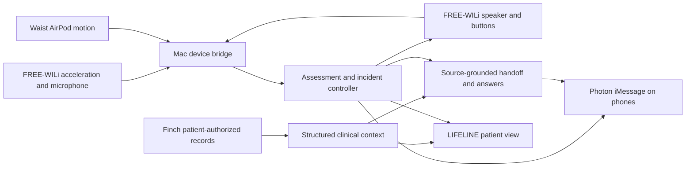

# FREE-WILi and FinchNode implementation plan

Updated October 3, 2026 after the supplied MHacks workshops. This is the target design; the current runtime still uses the legacy iPhone motion/audio client and the three-category Finch demo adapter. Hardware migration and the structured patient view are not implemented yet. The primary track remains Actually Intelligent (AI).

## Device roles

- FREE-WILi replaces the phone as the primary wearable accelerometer, microphone, speaker, and explicit help/cancel control. Record its actual mounting placement during setup.
- The waist-mounted AirPod Pro continues using the existing Mac acquisition and unchanged `KeepAlive.swift`.
- The iPhone carries wearer/responder iMessage communication through Photon. It supplies no motion, camera, or speech evidence in the target design.
- The Mac hosts acquisition, transcription, model inference, incident policy, Finch reads, and the patient/incident console. No model inference on the board is assumed.
- Camera acquisition and image interpretation are removed from scope. Repository inspection found no camera implementation or permission to delete.

## FREE-WILi bridge

Workshop pages 16–18 describe host control, WASM, and custom BSP firmware; pages 23–26 use the original two-RP2040 board and `wiliOGbsp`. The current [OneWili reference](https://freewili.com/onewili/) describes FreeWili 2. Match the actual board and firmware before choosing that API; do not assume its gyro/orientation or text-to-speech commands exist on OG.

The inspected [OG BSP](https://github.com/freewili/wiliOGbsp) supplies LIS3DH acceleration, PDM microphone decoding, I2S speaker playback, buttons, LEDs, and a display USB CDC endpoint. Prefer a small OG display-side app and host bridge if the supplied board is OG; keep the template main CPU/watchdog. Build and flash the combined `*_main` image only after the board is available.

The primary packet should identify `body-wili`, session, sequence, device capture time/clock domain, measured acceleration XYZ in g, configured range, measured cadence, and mounting identity. Preserve host receive time separately. Accelerometer-only packets have no quaternion, gyro, or measured fused gravity; do not synthesize zero rotation or a constant quaternion to satisfy the old `MotionSample` validator. Any gravity/tilt estimate needs an explicit method and validity flag. Reconnects, time discontinuities, range changes, and remounts invalidate calibration. Existing `chest-phone` recordings remain historical iPhone data and must never be relabelled as WILi captures.

The OG driver supports a 100 Hz mode. Verify delivered cadence and gaps. Its default ±2 g per-axis range can clip impacts before the old detector's 2.5 g magnitude threshold, depending on direction; configure a supported wider range, preserve the range in recordings, detect saturation, and tune against new physical trials. The driver can report a successful poll without a new acquisition: emit only fresh samples, rather than relabelling repeated data with increasing sequence/time. Cross-body assessment can combine WILi impact with AirPod posture and motion when timing and both sources are usable. Single-source assessment needs an accelerometer-specific rule; reuse neither the old gyro quiet test nor the iPhone calibration blindly.

OG audio uses 8 kHz signed 16-bit mono PCM. The microphone decoder maintains CIC filter state; the existing diagnostic commands return summaries rather than speech audio. Add bounded PCM upload and speaker playback commands, resample provider audio on the host, and transcribe completed utterances on the Mac. Keep audio buffers and motion sampling independent. Measure audio-induced gaps and round-trip latency. Raw audio is transient by default; store the final transcript, source, timing, check-in ID, and decision. A board button sends an explicit current-check-in command. Positive speech/text preserves the existing deadline; it does not cancel. Show actual playback/listening failure and retain a working help/cancel button.

## Data collected, processed, and displayed

The EHR screen is LIFELINE's patient-record view. [Finch is read-only](https://finchnode.com/llms-full.txt); this integration does not write a fall, transcript, or AI summary back to a hospital EHR.

| Origin | Collect | Process | Show |
| --- | --- | --- | --- |
| FREE-WILi + AirPod | Raw motion, identities, capture/receive clocks, range/capabilities, calibration and gaps | Clock alignment and explainable candidate features; freeze a bounded evidence window at the incident | Measured impact/posture/motion features with time, source sessions, quality and unavailable fields; live charts remain separately labelled |
| Wearer | Completed microphone transcript, explicit button actions, correlated iMessage replies | Existing deterministic help/confirmation/ambiguity policy | Exact words/actions, channel, time and recorded decision |
| Finch | Patient identity and consent-filtered normalized clinical records, source metadata and category outcomes | Validate fields; preserve source IDs, dates, statuses, codes/units and incomplete categories | Patient record cards with clear synthetic/source/freshness labels |
| Responders | Authorized acceptance, reported departure/arrival, original questions and reported outcomes | Existing ownership, correlation, deadline and outbox policy | Actor, channel, time, reported progress/outcome and actual submission result |
| AI | Structured selection of known incident/clinical facts | Validate source IDs/fields and render original values | Concise handoff/Q&A, per-artifact generation status, clinical snapshot revision and citations |

Request `demographics,medications,conditions,allergies,vitals` for the first patient view. Expand labs, encounters or documents only when the experience needs them. Insurance/claims and all ten categories are unnecessary for this first incident.

Record rows should preserve `id`, consent category and section/resource type, source/sourceRecordId, sourceName, codes, returned clinical fields, record date, sourceUpdatedAt and syncedAt. The envelope also needs subject, requested/available/missing categories, consent status/receipts/expiry, sync metadata, warnings, dataAsOf and local fetchedAt. Distinguish available, empty, partial, unavailable, out-of-scope and revoked; one global boolean cannot express these states. `meta.categoryOutcomes` is demo-only: preserve its simulated states for the fixture, but derive authenticated availability from consent, available/missing categories, source sync metadata and warnings. Do not assume sandbox/live returns simulated counts or `isStale`. Avoid duplicate clinical rows when `documents`/`clinicalNotes` aliases share an ID or demographics repeats its primary record in `records`.

- **Allergies:** substance, reaction, severity, recorded status/verification and source. An empty list does not establish no allergies.
- **Medications:** distinguish prescribed regimen/status from dispense and administration records. The live demo returns completed regimens as well as active ones; retain both with labels. A prescription is not proof of adherence or a current administered dose.
- **Conditions:** show the documented condition and status/date; do not infer the cause of the current incident.
- **Historical vitals:** show value, unit, clinical measurement date and source. The baseline fixture's latest vital measurements are from July 18, 2026, even though records were synced August 25 and fetched now. Current heart rate, oxygen saturation, blood pressure and temperature remain unavailable from this device set.
- **Dates:** distinguish clinical measurement/record date, source update, Finch sync/watermark and local retrieval. A successful read does not establish a fresh measurement. Simulated consent/sync and null freshness must remain labelled simulated/unknown.

The full patient view and the concise handoff have different purposes. Keep historical values out of claims about current vitals; include them only with their measurement dates when requested. Preserve record status when selecting clinical facts, and cite the clinical snapshot revision for each AI artifact.

The current provider extracts only medications, conditions and allergies into text. It omits medication administration/dispense sidecars, structured rows, and completeness metadata. `server.ts` holds one startup health promise for all incidents; the raw source cache is process-local. Replace this with explicit wearer/Finch subject mapping, a current patient context, and immutable synthetic context revisions attached to each incident/handoff. New reads must not silently change an older handoff's meaning. Keep high-rate raw motion out of the clinical record list; refer to an incident evidence attachment instead.

Use the keyless synthetic fixture to build the structured view immediately. Keep fictional patient identity separate from the real demo wearer's identity. Full sandbox Connect is the next integration step, using a server-only `FINCHNODE_API_KEY`:

1. Create `POST /api/v1/connect/sessions` with an opaque wearer reference and required categories.
2. In sandbox, call `POST /connect/sessions/{id}/simulate`.
3. Poll the same session until `simulation.state` is completed; session status alone can complete earlier. Bind only its returned subject to the initiating wearer/session.
4. Read `/users/{subject}/records` and preserve consent/category/source outcomes. A return URL or a generic user-list entry is not identity evidence.

Use Connect rather than TEFCA for this structured ongoing-record workflow. No production patient access is needed for the hackathon. Authenticated snapshots are private/no-store; do not treat a local cached copy as ongoing authorization. Revocation/scope errors stop clinical disclosure and invalidate pending clinical replies while the incident response continues with health context unavailable. Production retention/deletion and authorized access require a separate implementation; synthetic persisted demo revisions do not establish that behavior.

## Implementation order

1. Add normalized patient-record contracts and adapter validation, including medication sidecars and historical vitals; add an authenticated structured-record route/view. Preserve the existing safe AI and incident-policy boundaries.
2. Bind incident handoffs to synthetic clinical revisions; add per-handoff provenance and a frozen motion evidence attachment. Label operator reports separately from Photon and board events.
3. Once the board arrives, verify model/firmware and capture wider-range raw acceleration over the appropriate transport. Add the honest accelerometer packet type, device health, alignment and calibration without changing the AirPod route keeper.
4. Implement explicit board help/cancel controls and incident-state display. Remove iPhone motion/audio/speech acquisition from the active build, old phone-specific prompt text, and active setup instructions; retain historic recordings as evidence of the old prototype only.
5. Add host-mediated board playback/transcription and test simultaneous audio/motion; then rehearse physical trigger → spoken check-in → Photon alert → ownership → sourced patient context → outcome.
6. Add sandbox Connect and verify subject binding, partial categories, empty records, revoked consent and unavailable sources with the official scenarios.

Acceptance requires real board samples and audio, source-correct clinical rows, dated historical vitals, consistent incident/clinical revisions, and unchanged deterministic ownership/deadline behavior. Neither slide support nor a compiled bridge establishes a working physical demo.
