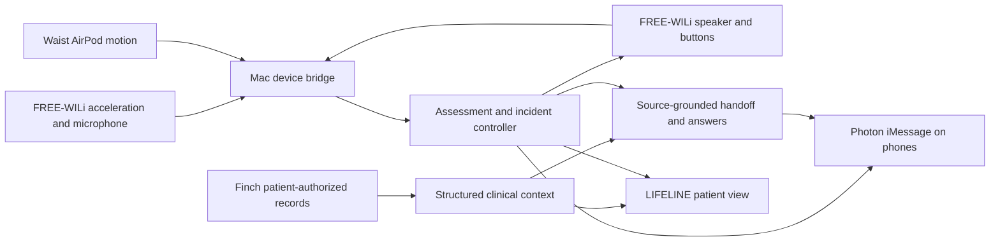

# FREE-WILi and FinchNode implementation plan

Updated October 3, 2026 after the supplied MHacks workshops. Structured Finch records, protected record Q&A, persisted incident revisions, care-brief export and the communication-only iPhone client are implemented. WILi acceleration transport, clock/quality validation, recording and explicit buttons have offline coverage. The original v54 board is connected through the official stock Python SDK. A provisional acceleration + waist movement/quiet detector, screen/button loop, PCM prompts and local Whisper transcription are implemented; physical behavior is under rehearsal. The primary track remains Actually Intelligent (AI).

## Device roles

- FREE-WILi replaces the phone as the primary wearable accelerometer, microphone, speaker, and explicit help/cancel control. Record its actual mounting placement during setup.
- The waist-mounted AirPod Pro continues using the existing Mac acquisition and unchanged `KeepAlive.swift`.
- The iPhone carries wearer/responder iMessage communication through Photon. It supplies no motion, camera, or speech evidence in the target design.
- The Mac hosts acquisition, transcription, model inference, incident policy, Finch reads, and the patient/incident console. No model inference on the board is assumed.
- Camera acquisition and image interpretation are removed from scope. Repository inspection found no camera implementation or permission to delete.

## FREE-WILi bridge

Workshop pages 16–18 describe host control, WASM, and custom BSP firmware; pages 23–26 use the original two-RP2040 board and `wiliOGbsp`. The current [OneWili reference](https://freewili.com/onewili/) describes FreeWili 2. Match the actual board and firmware before choosing that API; do not assume its gyro/orientation or text-to-speech commands exist on OG.

The inspected [OG BSP](https://github.com/freewili/wiliOGbsp) supplies LIS3DH acceleration, PDM microphone decoding, I2S speaker playback, buttons, LEDs, and a display USB CDC endpoint. The acquired device is OG running stock v54. Use `native/freewili/stock-bridge.ts` and the pinned official Python SDK for acceleration, buttons, display and audio; no custom firmware or flash is needed for this path. The custom firmware adapter remains optional.

Primary packets identify `body-wili`, session, sequence, actual clock domain, measured acceleration XYZ in g and configured range; cadence is measured at the host and placement is recorded during setup. Stock packets use gateway `host-receipt` timing and preserve the raw board frame timestamp without assuming its units. Clock exchange maps the gateway, not board acquisition time; preserve backend receipt separately. Custom firmware can supply its separate device-monotonic capture clock. Accelerometer-only packets have no quaternion, gyro, or measured fused gravity; do not synthesize unsupported values to satisfy the old `MotionSample` validator. Optional standing calibration belongs to AirPod tilt, not the WILi detector. Existing `chest-phone` recordings remain historical iPhone data and must never be relabelled as WILi captures.

The OG driver supports a 100 Hz mode, but the delivered stock event cadence can be sparse and must be measured. Its default ±2 g per-axis range can clip impacts before the old detector's 2.5 g magnitude threshold, depending on direction; the stock prototype instead uses a provisional 1.65 g magnitude threshold, preserves the actual 2 g range, excludes clipping, and still needs physical trials. Sparse receipt gaps do not turn the gateway clock into board capture timing or establish continuous primary motion. Emit only actual new samples. Cross-body assessment combines WILi impact with correlated AirPod movement/rotation and continuous waist quiet when both sources are usable and aligned. It does not require standing tilt calibration and has no single-source fallback. Custom device-monotonic firmware retains its separate wider-range 2.5 g profile.

OG audio uses 8 kHz signed 16-bit mono PCM. The microphone decoder maintains CIC filter state; stock audio events stream signed PCM. The implementation captures at most six seconds after prompt playback, uses seven cached canonical 8 kHz PCM WAV assets for the board, and runs local Whisper on 16 kHz resampled utterances. The board cache can be explicitly prepared with ElevenLabs or macOS local speech, with generation provenance in its manifest; configuration does not establish provider generation or audibility. Keep audio buffers and motion sampling independent. Measure audio-induced gaps and round-trip latency. Raw audio is transient by default; store the final transcript, source, timing, check-in ID, and decision. A board button sends an explicit current-check-in command. Positive speech/text preserves the existing deadline; it does not cancel. Show actual playback/listening failure and retain a working help/cancel button.

## Data collected, processed, and displayed

The EHR screen is LIFELINE's patient-record view. [Finch is read-only](https://finchnode.com/llms-full.txt); this integration does not write a fall, transcript, or AI summary back to a hospital EHR.

| Origin | Collect | Process | Show |
| --- | --- | --- | --- |
| FREE-WILi + AirPod | Raw motion, identities, capture/receive clocks, range/capabilities, calibration and gaps | Clock alignment and explainable candidate features; freeze a bounded evidence window at the incident | Measured impact/posture/motion features with time, source sessions, quality and unavailable fields; live charts remain separately labelled |
| Wearer | Completed microphone transcript, explicit button actions, correlated iMessage replies | Existing deterministic help/confirmation/ambiguity policy | Exact words/actions, channel, time and recorded decision |
| Finch | Patient identity and consent-filtered normalized clinical records, source metadata and category outcomes | Validate fields; preserve source IDs, dates, statuses, codes/units and incomplete categories | Patient record cards with clear synthetic/source/freshness labels |
| Responders | Authorized acceptance, reported departure/arrival, original questions and reported outcomes | Existing ownership, correlation, deadline and outbox policy | Actor, channel, time, reported progress/outcome and actual submission result |
| AI | Structured selection of known incident/clinical facts | Validate source IDs/fields and render original values | Concise handoff/Q&A, per-artifact generation status, clinical snapshot revision and citations |

Request `demographics,medications,conditions,allergies,vitals` for the first patient view. Expand labs, encounters or documents only when the experience needs them. Insurance/claims and all ten categories are unnecessary for this first incident.

Record rows should preserve `id`, consent category and section/resource type, source/sourceRecordId, sourceName, codes, returned clinical fields, record date, sourceUpdatedAt and syncedAt. The envelope also needs subject, requested/available/missing categories, consent status/receipts/expiry, sync metadata, warnings, dataAsOf and local fetchedAt. Distinguish available, empty, partial, unavailable, out-of-scope and revoked; one global boolean cannot express these states. `meta.categoryOutcomes` is demo-only: preserve its simulated states for the fixture, but derive authenticated availability from consent, available/missing categories, source sync metadata and warnings. Do not assume sandbox/live returns simulated counts or `isStale`. Avoid duplicate clinical rows when `documents`/`clinicalNotes` aliases share an ID or demographics repeats its primary record in `records`.

- **Allergies:** substance, reaction, severity, recorded status/verification and source. An empty list does not establish no allergies.
- **Medications:** distinguish prescribed regimen/status from dispense and administration records. The live demo returns completed regimens as well as active ones; retain both with labels. A prescription is not proof of adherence or a current administered dose.
- **Conditions:** show the documented condition and status/date; do not infer the cause of the current incident.
- **Historical vitals:** show value, unit, clinical measurement date and source. The baseline fixture's latest vital measurements are from July 18, 2026, even though records were synced August 25 and fetched now. Current heart rate, oxygen saturation, blood pressure and temperature remain unavailable from this device set.
- **Dates:** distinguish clinical measurement/record date, source update, Finch sync/watermark and local retrieval. A successful read does not establish a fresh measurement. Simulated consent/sync and null freshness must remain labelled simulated/unknown.

The full patient view and the concise handoff have different purposes. Keep historical values out of claims about current vitals; include them only with their measurement dates when requested. Preserve record status when selecting clinical facts, and cite the clinical snapshot revision for each AI artifact.

The provider now normalizes the five requested categories, medication administration/dispense sidecars and returned completeness metadata. The protected view exposes the current synthetic context; each incident binds one immutable context in SQLite, with its revision on the handoff and Q&A audit. Refresh affects the current record, not an older incident. Patient questions can run without fabricating an incident. Explicit wearer/Finch subject mapping through sandbox Connect remains pending. Keep high-rate motion outside the clinical record list; the export separates hospital records from the local incident log.

Use the keyless synthetic fixture to build the structured view immediately. Keep fictional patient identity separate from the real demo wearer's identity. Full sandbox Connect is the next integration step, using a server-only `FINCHNODE_API_KEY`:

1. Create `POST /api/v1/connect/sessions` with an opaque wearer reference and required categories.
2. In sandbox, call `POST /connect/sessions/{id}/simulate`.
3. Poll the same session until `simulation.state` is completed; session status alone can complete earlier. Bind only its returned subject to the initiating wearer/session.
4. Read `/users/{subject}/records` and preserve consent/category/source outcomes. A return URL or a generic user-list entry is not identity evidence.

Use Connect rather than TEFCA for this structured ongoing-record workflow. No production patient access is needed for the hackathon. Authenticated snapshots are private/no-store; do not treat a local cached copy as ongoing authorization. Revocation/scope errors stop clinical disclosure and invalidate pending clinical replies while the incident response continues with health context unavailable. Production retention/deletion and authorized access require a separate implementation; synthetic persisted demo revisions do not establish that behavior.

## Implementation status and next steps

Completed: normalized demo record adapter/view, immutable incident context and handoff provenance, communication-only iPhone build, threaded Photon replies, source-separated brief export, official stock WILi acquisition/display/buttons, provisional WILi + waist assessment with frozen evidence, cached PCM prompts, and bounded local Whisper recognition. Custom host transport remains an optional separate path.

Remaining order:

1. Rehearse the connected stock v54 board with the mounted waist stream. Measure actual cadence, receipt gaps, clipping, gateway timing and the provisional candidate; a custom wider-range firmware is not required for this first demo.
2. Verify the existing display, cached prompt audibility, bounded microphone recognition and explicit controls through the complete incident loop. Configure the real local Whisper model/CLI; validate simultaneous audio/motion and deadline timing.
3. Verify the cached voice assets' generation source before making an ElevenLabs claim. Provider preparation, board upload/command acceptance and observed playback are separate results.
4. Configure approved Photon phones and rehearse real check-in, contextual Q&A, ownership, progress and outcome. Native cards can follow once this chain works.
5. Add sandbox Connect and verify subject binding, partial/empty records, revoked consent and unavailable sources. Keep newly reported information in LIFELINE’s care log and export; do not promise hospital writeback.

Acceptance requires real board samples and audio, source-correct clinical rows, dated historical vitals, consistent incident/clinical revisions, and unchanged deterministic ownership/deadline behavior. Neither slide support nor a compiled bridge establishes a working physical demo.
